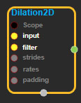
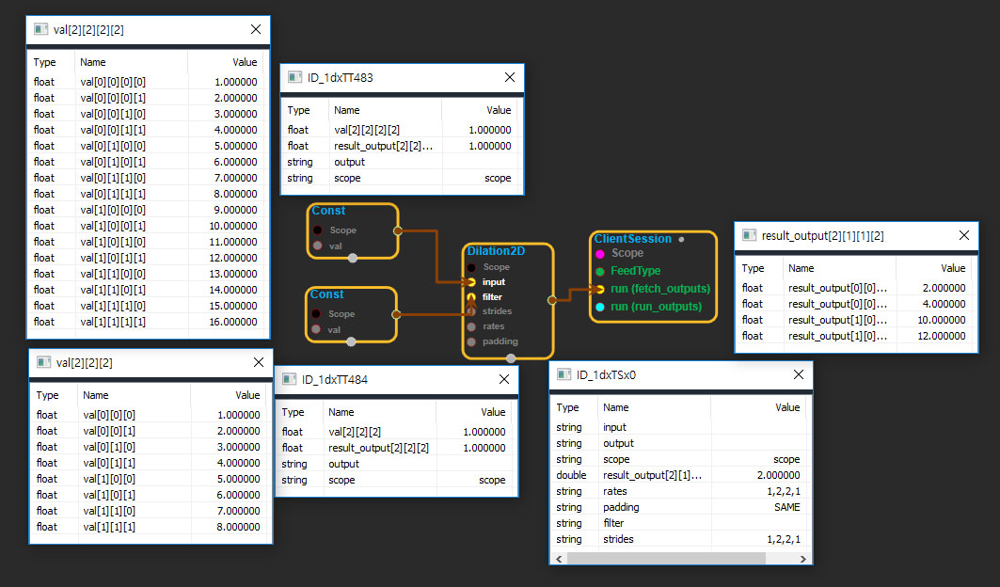

--- 
layout: default 
title: Dilation2D 
parent: nn_ops 
grand_parent: enuSpace-Tensorflow API 
last_modified_date: now 
--- 

# Dilation2D

---

## tensorflow C++ API

[tensorflow::ops::Dilation2D](https://www.tensorflow.org/api_docs/cc/class/tensorflow/ops/dilation2-d)

Computes the grayscale dilation of 4-D`input`and 3-D`filter`tensors.

---

## Summary

The`input`tensor has shape`[batch, in_height, in_width, depth]`and the`filter`tensor has shape`[filter_height, filter_width, depth]`, i.e., each input channel is processed independently of the others with its own structuring function. The`output`tensor has shape`[batch, out_height, out_width, depth]`. The spatial dimensions of the output tensor depend on the`padding`algorithm. We currently only support the default "NHWC"`data_format`.

In detail, the grayscale morphological 2-D dilation is the max-sum correlation \(for consistency with`conv2d`, we use unmirrored filters\):

```
output[b, y, x, c]=
   max_{dy, dx} input[b,strides[1]*y + rates[1]* dy, 
                        strides[2]*x + rates[2]* dx,
                        c]  +
                filter[dy, dx, c]
```

Max-pooling is a special case when the filter has size equal to the pooling kernel size and contains all zeros.

Note on duality: The dilation of`input`by the`filter`is equal to the negation of the erosion of`-input`by the reflected`filter`.

Arguments:

* scope: A [Scope](https://www.tensorflow.org/api_docs/cc/class/tensorflow/scope.html#classtensorflow_1_1_scope) object
* input: 4-D with shape`[batch, in_height, in_width, depth]`.
* filter: 3-D with shape`[filter_height, filter_width, depth]`.
* strides: The stride of the sliding window for each dimension of the input tensor. Must be:
  `[1, stride_height, stride_width, 1]`.
* rates: The input stride for atrous morphological dilation. Must be:`[1, rate_height, rate_width, 1]`.
* padding: The type of padding algorithm to use.

Returns:

* [`Output`](https://www.tensorflow.org/api_docs/cc/class/tensorflow/output.html#classtensorflow_1_1_output): 4-D with shape`[batch, out_height, out_width, depth]`.

---

## Dilation2D block

Source link : [https://github.com/EXPNUNI/enuSpaceTensorflow/blob/master/enuSpaceTensorflow/tf\_nn.cpp](https://github.com/EXPNUNI/enuSpaceTensorflow/blob/master/enuSpaceTensorflow/tf_random.cpp)



Argument:

* Scope scope : A Scope object \(A scope is generated automatically each page. A scope is not connected.\)
* Input input: connect  Input node.
* Input filter: connect  Input node.
* gtl::ArraySlice&lt; int &gt; strides: Input strides in value ex\)1,2,2,1
* gtl::ArraySlice&lt; int &gt; rates: Input strides in value ex\)1,2,2,1
* StringPiece padding: Input paddingin value ex\)SAME
* Dilation2D ::Attrs attrs : Input attrs in value. ex\) data\_format\_ = NHWC;

Return:

* Output output : Output object of Dilation2D class object.

Result:

* std::vector\(Tensor\) _result\_output_ : Returned object of executed result by calling session.

---

## Using Method

## 


