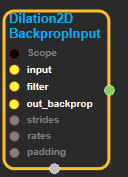

--- 
layout: default 
title: Dilation2DBackpropInput 
parent: nn_ops 
grand_parent: enuSpace-Tensorflow API 
last_modified_date: now 
--- 

# Dilation2DBackpropInput

---

## tensorflow C++ API

[tensorflow::ops::Dilation2DBackpropInput](https://www.tensorflow.org/api_docs/cc/class/tensorflow/ops/dilation2-d-backprop-input)

Computes the gradient of morphological 2-D dilation with respect to the input.

---

## Summary

Arguments:

* scope: A [Scope](https://www.tensorflow.org/api_docs/cc/class/tensorflow/scope.html#classtensorflow_1_1_scope) object
* input: 4-D with shape`[batch, in_height, in_width, depth]`.
* filter: 3-D with shape`[filter_height, filter_width, depth]`.
* out\_backprop: 4-D with shape`[batch, out_height, out_width, depth]`.
* strides: 1-D of length 4. The stride of the sliding window for each dimension of the input tensor. Must be:
  `[1, stride_height, stride_width, 1]`.
* rates: 1-D of length 4. The input stride for atrous morphological dilation. Must be:
  `[1, rate_height, rate_width, 1]`.
* padding: The type of padding algorithm to use.

Returns:

* [`Output`](https://www.tensorflow.org/api_docs/cc/class/tensorflow/output.html#classtensorflow_1_1_output): 4-D with shape`[batch, in_height, in_width, depth]`.

---

## Dilation2DBackpropInput block

Source link : [https://github.com/EXPNUNI/enuSpaceTensorflow/blob/master/enuSpaceTensorflow/tf\_nn.cpp](https://github.com/EXPNUNI/enuSpaceTensorflow/blob/master/enuSpaceTensorflow/tf_random.cpp)

Argument:

* Scope scope : A Scope object \(A scope is generated automatically each page. A scope is not connected.\)
* Input input: connect  Input node.
* Input filter: connect  Input node.
* Input out\_backprop: connect  Input node.
* gtl::ArraySlice&lt; int &gt; strides: Input strides in value ex\)1,2,2,1
* gtl::ArraySlice&lt; int &gt; rates: Input strides in value ex\)1,2,2,1
* StringPiece padding: Input paddingin value ex\)SAME
* Dilation2DBackpropInput::Attrs attrs : Input attrs in value. ex\) data\_format\_ = NHWC;

Return:

* Output in\_backprop : Output object of Dilation2DBackpropInput class object.

Result:

* std::vector\(Tensor\) result\_in\_backprop : Returned object of executed result by calling session.

---

## Using Method

## 

