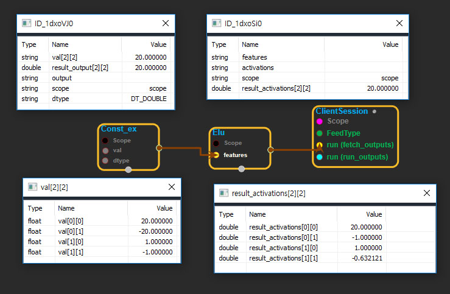

--- 
layout: default 
title: Elu 
parent: nn_ops 
grand_parent: enuSpace-Tensorflow API 
last_modified_date: now 
--- 

# Elu

---

## tensorflow C++ API

[tensorflow::ops::Elu](https://www.tensorflow.org/api_docs/cc/class/tensorflow/ops/elu)

Computes the gradient of morphological 2-D dilation with respect to the filter.

---

## Summary

See[Fast and Accurate Deep Network Learning by Exponential Linear Units \(ELUs\)](http://arxiv.org/abs/1511.07289)

Arguments:

* scope: A [Scope](https://www.tensorflow.org/api_docs/cc/class/tensorflow/scope.html#classtensorflow_1_1_scope) object

Returns:

* [`Output`](https://www.tensorflow.org/api_docs/cc/class/tensorflow/output.html#classtensorflow_1_1_output): The activations tensor.

---

## Elu block

Source link : [https://github.com/EXPNUNI/enuSpaceTensorflow/blob/master/enuSpaceTensorflow/tf\_nn.cpp](https://github.com/EXPNUNI/enuSpaceTensorflow/blob/master/enuSpaceTensorflow/tf_random.cpp)

Argument:

* Scope scope : A Scope object \(A scope is generated automatically each page. A scope is not connected.\)
* Input features: connect  Input node.

Return:

* Output activations : Output object of Elu class object.

Result:

* std::vector\(Tensor\) result\_activations  : Returned object of executed result by calling session.

---

## Using Method

## 

