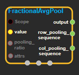
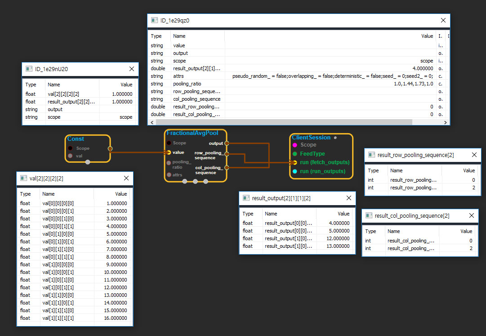

--- 
layout: default 
title: FractionalAvgPool 
parent: nn_ops 
grand_parent: enuSpace-Tensorflow API 
last_modified_date: now 
--- 

# FractionalAvgPool

---

## tensorflow C++ API

[tensorflow::ops::FractionalAvgPool](https://www.tensorflow.org/api_docs/cc/class/tensorflow/ops/fractional-avg-pool)

Performs fractional average pooling on the input.

---

## Summary

Fractional average pooling is similar to Fractional max pooling in the pooling region generation step. The only difference is that after pooling regions are generated, a mean operation is performed instead of a max operation in each pooling region.

Arguments:

* scope: A [Scope](https://www.tensorflow.org/api_docs/cc/class/tensorflow/scope.html#classtensorflow_1_1_scope) object
* value: 4-D with shape `[batch, height, width, channels]`.
* pooling\_ratio: Pooling ratio for each dimension of`value`, currently only supports row and col dimension and should be 
  &gt;= 1.0. For example, a valid pooling ratio looks like \[1.0, 1.44, 1.73, 1.0\]. The first and last elements must be 1.0 because we don't allow pooling on batch and channels dimensions. 1.44 and 1.73 are pooling ratio on height and width dimensions respectively.

Optional attributes \(see[`Attrs`](https://www.tensorflow.org/api_docs/cc/struct/tensorflow/ops/fractional-avg-pool/attrs.html#structtensorflow_1_1ops_1_1_fractional_avg_pool_1_1_attrs)\):

* pseudo\_random: When set to True, generates the pooling sequence in a pseudorandom fashion, otherwise, in a random fashion. Check paper [Benjamin Graham, Fractional Max-Pooling](http://arxiv.org/abs/1412.6071)for difference between pseudorandom and random.
* overlapping: When set to True, it means when pooling, the values at the boundary of adjacent pooling cells are used by both cells. For example:

`index 0 1 2 3 4`

`value 20 5 16 3 7`

If the pooling sequence is \[0, 2, 4\], then 16, at index 2 will be used twice. The result would be \[41/3, 26/3\] for fractional avg pooling.

* deterministic: When set to True, a fixed pooling region will be used when iterating over a [FractionalAvgPool](https://www.tensorflow.org/api_docs/cc/class/tensorflow/ops/fractional-avg-pool.html#classtensorflow_1_1ops_1_1_fractional_avg_pool)
  node in the computation graph. Mainly used in unit test to make [FractionalAvgPool](https://www.tensorflow.org/api_docs/cc/class/tensorflow/ops/fractional-avg-pool.html#classtensorflow_1_1ops_1_1_fractional_avg_pool) deterministic.
* seed: If either seed or seed2 are set to be non-zero, the random number generator is seeded by the given seed. Otherwise, it is seeded by a random seed.
* seed2: An second seed to avoid seed collision.

Returns:

* [`Output`](https://www.tensorflow.org/api_docs/cc/class/tensorflow/output.html#classtensorflow_1_1_output)output: output tensor after fractional avg pooling.
* [`Output`](https://www.tensorflow.org/api_docs/cc/class/tensorflow/output.html#classtensorflow_1_1_output)row\_pooling\_sequence: row pooling sequence, needed to calculate gradient.
* [`Output`](https://www.tensorflow.org/api_docs/cc/class/tensorflow/output.html#classtensorflow_1_1_output)col\_pooling\_sequence: column pooling sequence, needed to calculate gradient.

---

## FractionalAvgPool block

Source link : [https://github.com/EXPNUNI/enuSpaceTensorflow/blob/master/enuSpaceTensorflow/tf\_nn.cpp](https://github.com/EXPNUNI/enuSpaceTensorflow/blob/master/enuSpaceTensorflow/tf_random.cpp)

Argument:

* Scope scope : A Scope object \(A scope is generated automatically each page. A scope is not connected.\)
* Input value: connect  Input node.
* Input features: connect  Input node.
* ArraySlice&lt; float&gt; pooling\__ratio: Input pooling_\_ratio in value ex\)1.0, 1.44, 1.73, 1.0
* FractionalAvgPool ::Attrs attrs : Input attrs in value. 
  ex\) pseudo\_random\_ = false;overlapping\_ = false;deterministic\_ = false;seed\_ = 0;seed2\_ = 0;

Return:

* Output output: Output object of FractionalAvgPool class object.
* Output row\_pooling\_sequence: Output object of FractionalAvgPool class object.
* Output col\_pooling\_sequence: Output object of FractionalAvgPool class object.

Result:

* std::vector\(Tensor\) result\_output  : Returned object of executed result by calling session.
* std::vector\(Tensor\) result\_row\_pooling\_sequence  : Returned object of executed result by calling session.
* std::vector\(Tensor\) result\_col\_pooling\_sequence  : Returned object of executed result by calling session.

---

## Using Method

