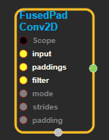
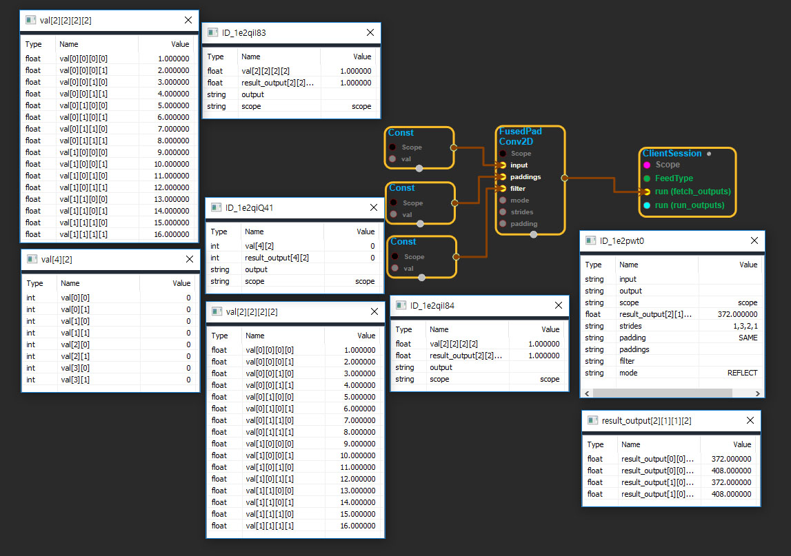

--- 
layout: default 
title: FusedPadConv2D 
parent: nn_ops 
grand_parent: enuSpace-Tensorflow API 
last_modified_date: now 
--- 

# FusedPadConv2D

---

## tensorflow C++ API

[tensorflow::ops::FusedPadConv2D](https://www.tensorflow.org/api_docs/cc/class/tensorflow/ops/fused-pad-conv2-d)

Performs a padding as a preprocess during a convolution.

---

## Summary

Similar to FusedResizeAndPadConv2d, this op allows for an optimized implementation where the spatial padding transformation stage is fused with the im2col lookup, but in this case without the bilinear filtering required for resizing. Fusing the padding prevents the need to write out the intermediate results as whole tensors, reducing memory pressure, and we can get some latency gains by merging the transformation calculations. The data\_format attribute for[Conv2D](https://www.tensorflow.org/api_docs/cc/class/tensorflow/ops/conv2-d.html#classtensorflow_1_1ops_1_1_conv2_d)isn't supported by this op, and 'NHWC' order is used instead. Internally this op uses a single per-graph scratch buffer, which means that it will block if multiple versions are being run in parallel. This is because this operator is primarily an optimization to minimize memory usage.

Arguments:

* scope: A [Scope](https://www.tensorflow.org/api_docs/cc/class/tensorflow/scope.html#classtensorflow_1_1_scope) object
* input: 4-D with shape`[batch, in_height, in_width, in_channels]`.
* paddings: A two-column matrix specifying the padding sizes. The number of rows must be the same as the rank of`input`.
* filter: 4-D with shape`[filter_height, filter_width, in_channels, out_channels]`.
* strides: 1-D of length 4. The stride of the sliding window for each dimension of`input`. Must be in the same order as the dimension specified with format.
* padding: The type of padding algorithm to use.

Returns:

* [`Output`](https://www.tensorflow.org/api_docs/cc/class/tensorflow/output.html#classtensorflow_1_1_output): The output tensor.

---

## FusedPadConv2D block

Source link : [https://github.com/EXPNUNI/enuSpaceTensorflow/blob/master/enuSpaceTensorflow/tf\_nn.cpp](https://github.com/EXPNUNI/enuSpaceTensorflow/blob/master/enuSpaceTensorflow/tf_random.cpp)

Argument:

* Scope scope : A Scope object \(A scope is generated automatically each page. A scope is not connected.\)
* Input input: connect  Input node.
* Input paddings: connect  Input node.
* Input filter: connect  Input node.
* StringPiece mode: Input mode in value. ex\) REFLECT
* ArraySlice&lt; int&gt; strides\_: Input \_strides in value ex\)1,3,2,1
* StringPiece mode: Input mode in value. ex\) SAME

Return:

* Output output: Output object of FusedPadConv2D class object.

Result:

* std::vector\(Tensor\) result\_output  : Returned object of executed result by calling session.

---

## Using Method

