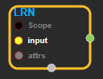
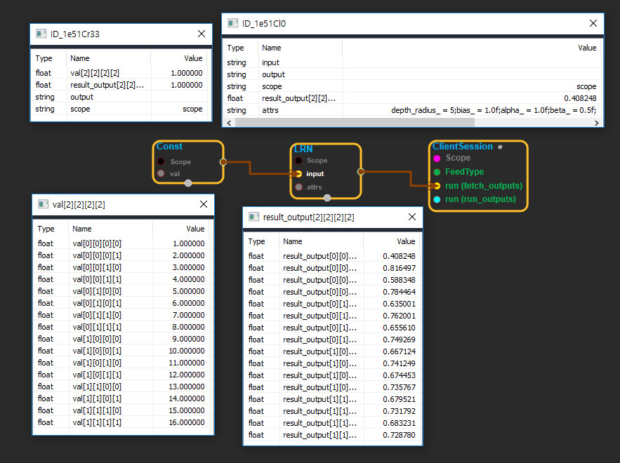

--- 
layout: default 
title: LRN 
parent: nn_ops 
grand_parent: enuSpace-Tensorflow API 
last_modified_date: now 
--- 

# LRN

---

## tensorflow C++ API

[tensorflow::ops::LRN](https://www.tensorflow.org/api_docs/cc/class/tensorflow/ops/l-r-n)

Local Response Normalization.

---

## Summary

The 4-D`input`tensor is treated as a 3-D array of 1-D vectors \(along the last dimension\), and each vector is normalized independently. Within a given vector, each component is divided by the weighted, squared sum of inputs within`depth_radius`. In detail,

```
sqr_sum[a, b, c, d] =
    sum(input[a, b, c, d - depth_radius : d + depth_radius + 1] ** 2)
output = input / (bias + alpha * sqr_sum) ** beta
```

For details, see[Krizhevsky et al., ImageNet classification with deep convolutional neural networks \(NIPS 2012\)](http://papers.nips.cc/paper/4824-imagenet-classification-with-deep-convolutional-neural-networks).

Arguments:

* scope: A [Scope](https://www.tensorflow.org/api_docs/cc/class/tensorflow/scope.html#classtensorflow_1_1_scope) object
* input: 4-D.

Optional attributes \(see[`Attrs`](https://www.tensorflow.org/api_docs/cc/struct/tensorflow/ops/l-r-n/attrs.html#structtensorflow_1_1ops_1_1_l_r_n_1_1_attrs)\):

* depth\_radius: 0-D. Half-width of the 1-D normalization window.
* bias: An offset \(usually positive to avoid dividing by 0\).
* alpha: A scale factor, usually positive.
* beta: An exponent.

Returns:

* [`Output`](https://www.tensorflow.org/api_docs/cc/class/tensorflow/output.html#classtensorflow_1_1_output): The output tensor.

---

## LRN block

Source link : [https://github.com/EXPNUNI/enuSpaceTensorflow/blob/master/enuSpaceTensorflow/tf\_nn.cpp](https://github.com/EXPNUNI/enuSpaceTensorflow/blob/master/enuSpaceTensorflow/tf_random.cpp)



Argument:

* Scope scope : A Scope object \(A scope is generated automatically each page. A scope is not connected.\)
* Input input: connect  Input node.
* LRN::Attrs attrs :inputs attrs in values ex\)depth\_radius\_ = 5;bias\_ = 1.0f;alpha\_ = 1.0f;beta\_ = 0.5f;

Return:

* Output output: Output object of LRN class object.

Result:

* std::vector\(Tensor\) result\_output  : Returned object of executed result by calling session.

---

## Using Method



