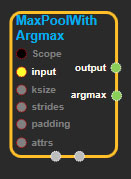
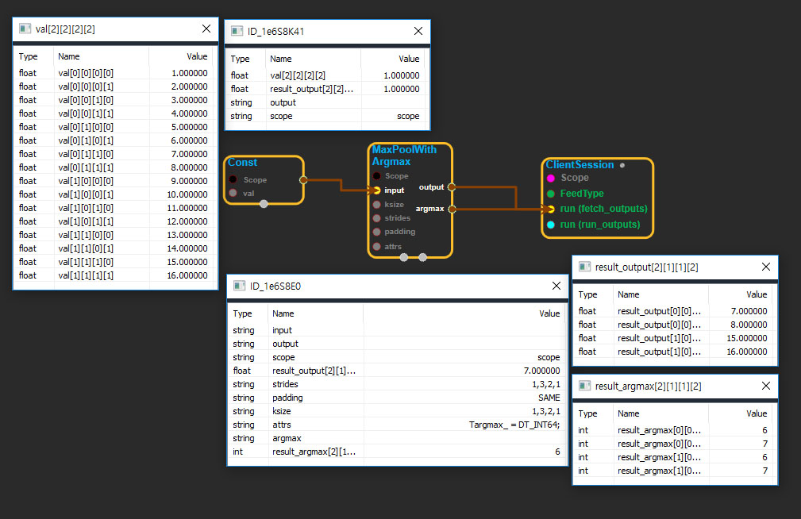

--- 
layout: default 
title: MaxPoolWithArgmax 
parent: nn_ops 
grand_parent: enuSpace-Tensorflow API 
last_modified_date: now 
--- 

# MaxPoolWithArgmax

---

## tensorflow C++ API

[tensorflow::ops::MaxPoolWithArgmax](https://www.tensorflow.org/api_docs/cc/class/tensorflow/ops/max-pool-with-argmax)

Performs max pooling on the input and outputs both max values and indices.

---

## Summary

The indices in`argmax`are flattened, so that a maximum value at position`[b, y, x, c]`becomes flattened index`((b * height + y) * width + x) * channels + c`.

The indices returned are always in`[0, height) x [0, width)`before flattening, even if padding is involved and the mathematically correct answer is outside \(either negative or too large\). This is a bug, but fixing it is difficult to do in a safe backwards compatible way, especially due to flattening.

Arguments:

* scope: A [Scope](https://www.tensorflow.org/api_docs/cc/class/tensorflow/scope.html#classtensorflow_1_1_scope) object
* input: 4-D with shape `[batch, height, width, channels]`.[Input](https://www.tensorflow.org/api_docs/cc/class/tensorflow/input.html#classtensorflow_1_1_input) to pool over.
* ksize: The size of the window for each dimension of the input tensor.
* strides: The stride of the sliding window for each dimension of the input tensor.
* padding: The type of padding algorithm to use.

Returns:

* [`Output`](https://www.tensorflow.org/api_docs/cc/class/tensorflow/output.html#classtensorflow_1_1_output)output: The max pooled output tensor.
* [`Output`](https://www.tensorflow.org/api_docs/cc/class/tensorflow/output.html#classtensorflow_1_1_output)argmax: 4-D. The flattened indices of the max values chosen for each output.

---

## MaxPoolWithArgmax block

Source link : [https://github.com/EXPNUNI/enuSpaceTensorflow/blob/master/enuSpaceTensorflow/tf\_nn.cpp](https://github.com/EXPNUNI/enuSpaceTensorflow/blob/master/enuSpaceTensorflow/tf_random.cpp)

Argument:

* Scope scope : A Scope object \(A scope is generated automatically each page. A scope is not connected.\)
* Input input: connect  Input node.
* ArraySlice&lt; int&gt; ksize: input ksize in values. ex\)1,2,2,2,1
* ArraySlice&lt; int&gt; strides: input ksize in values. ex\)1,4,3,2,1
* stringpiece padding: input padding in value. ex\)SAME

Return:

* Output output: Output object of MaxPoolWithArgmax class object.
* Output argmax: Output object of MaxPoolWithArgmax class object.

Result:

* std::vector\(Tensor\) result\_output  : Returned object of executed result by calling session.
* std::vector\(Tensor\) result\_argmax  : Returned object of executed result by calling session.

---

## Using Method

