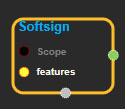
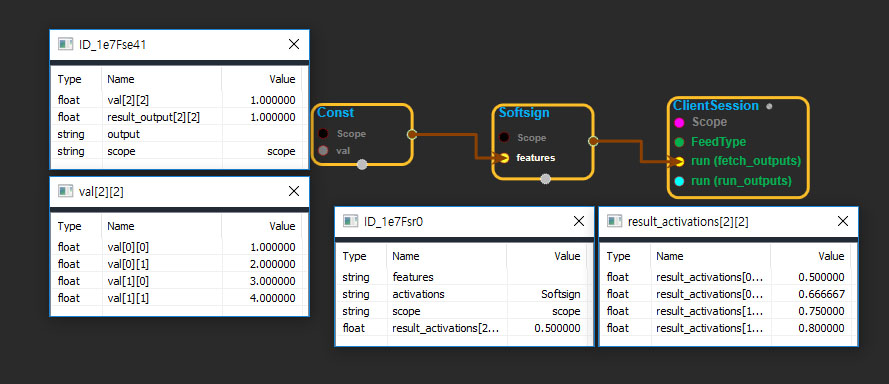

--- 
layout: default 
title: Softsign 
parent: nn_ops 
grand_parent: enuSpace-Tensorflow API 
last_modified_date: now 
--- 

# Softsign

---

## tensorflow C++ API

[tensorflow::ops::Softplus](https://www.tensorflow.org/api_docs/cc/class/tensorflow/ops/softplus)

Computes softsign:`features / (abs(features) + 1)`.

---

## Summary

Arguments:

* scope: A [Scope](https://www.tensorflow.org/api_docs/cc/class/tensorflow/scope.html#classtensorflow_1_1_scope) object.

Returns:

* [`Output`](https://www.tensorflow.org/api_docs/cc/class/tensorflow/output.html#classtensorflow_1_1_output): The activations tensor.

---

## Softsign block

Source link : [https://github.com/EXPNUNI/enuSpaceTensorflow/blob/master/enuSpaceTensorflow/tf\_nn.cpp](https://github.com/EXPNUNI/enuSpaceTensorflow/blob/master/enuSpaceTensorflow/tf_random.cpp)

Argument:

* Scope scope : A Scope object \(A scope is generated automatically each page. A scope is not connected.\)
* Input features: connect  Input node.

Return:

* Output activations: Output object of Softplus class object.

Result:

* std::vector\(Tensor\) result\_activations : Returned object of executed result by calling session.

---

## Using Method

