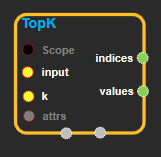

--- 
layout: default 
title: TopK 
parent: nn_ops 
grand_parent: enuSpace-Tensorflow API 
last_modified_date: now 
--- 

# TopK

---

## tensorflow C++ API

[tensorflow::ops::TopK](https://www.tensorflow.org/api_docs/cc/class/tensorflow/ops/top-k)

Finds values and indices of the`k`largest elements for the last dimension.

---

## Summary

If the input is a vector \(rank-1\), finds the`k`largest entries in the vector and outputs their values and indices as vectors. Thus`values[j]`is the`j`-th largest entry in`input`, and its index is`indices[j]`.

For matrices \(resp. higher rank input\), computes the top`k`entries in each row \(resp. vector along the last dimension\). Thus,

```
values.shape = indices.shape = input.shape[:-1]+[k]
```

If two elements are equal, the lower-index element appears first.

Arguments:

* scope: A [Scope](https://www.tensorflow.org/api_docs/cc/class/tensorflow/scope.html#classtensorflow_1_1_scope) object
* input: 1-D or higher with last dimension at least`k`.
* k: 0-D. Number of top elements to look for along the last dimension \(along each row for matrices\).

Optional attributes \(see[`Attrs`](https://www.tensorflow.org/api_docs/cc/struct/tensorflow/ops/top-k/attrs.html#structtensorflow_1_1ops_1_1_top_k_1_1_attrs)\):

* sorted: If true the resulting`k`elements will be sorted by the values in descending order.

Returns:

* [`Output`](https://www.tensorflow.org/api_docs/cc/class/tensorflow/output.html#classtensorflow_1_1_output)values: The`k`largest elements along each last dimensional slice.
* [`Output`](https://www.tensorflow.org/api_docs/cc/class/tensorflow/output.html#classtensorflow_1_1_output)indices: The indices of`values`within the last dimension of`input`.

---

## TopK block

Source link : [https://github.com/EXPNUNI/enuSpaceTensorflow/blob/master/enuSpaceTensorflow/tf\_nn.cpp](https://github.com/EXPNUNI/enuSpaceTensorflow/blob/master/enuSpaceTensorflow/tf_random.cpp)



Argument:

* Scope scope : A Scope object \(A scope is generated automatically each page. A scope is not connected.\)
* Input input: connect  Input node.
* Input k: connect  Input node.
* TopK::Attrs atttrs: input attrs in values. ex\)sorted:true;

Return:

* Output indices: Output object of TopK class object.
* Output values: Output object of TopK class object.

Result:

* std::vector\(Tensor\) result\_indices: Returned object of executed result by calling session.
* std::vector\(Tensor\) result\_values: Returned object of executed result by calling session.

---

## Using Method


