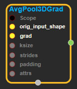
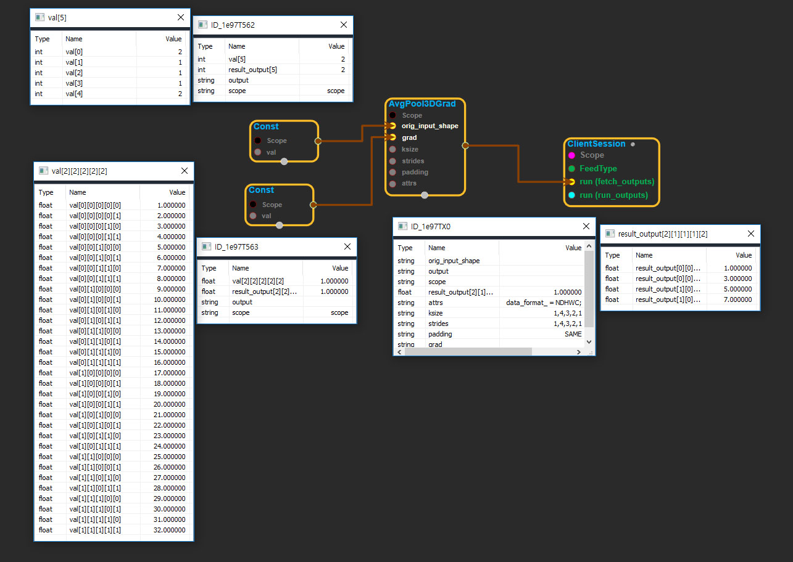

--- 
layout: default 
title: AvgPool3DGrad 
parent: nn_ops 
grand_parent: enuSpace-Tensorflow API 
last_modified_date: now 
--- 

# AvgPool3DGrad

---

## tensorflow C++ API

[tensorflow::ops::AvgPool3DGrad](https://www.tensorflow.org/api_docs/cc/class/tensorflow/ops/avg-pool3-d-grad)

Computes gradients of average pooling function.

---

## Summary

Arguments:

* scope: A [Scope](https://www.tensorflow.org/api_docs/cc/class/tensorflow/scope.html#classtensorflow_1_1_scope) object
* orig\_input\_shape: The original input dimensions.
* grad:[Output](https://www.tensorflow.org/api_docs/cc/class/tensorflow/output.html#classtensorflow_1_1_output) backprop of shape`[batch, depth, rows, cols, channels]`.
* ksize: 1-D tensor of length 5. The size of the window for each dimension of the input tensor. Must have
  `ksize[0] = ksize[4] = 1`.
* strides: 1-D tensor of length 5. The stride of the sliding window for each dimension of`input`. Must have
  `strides[0] = strides[4] = 1`.
* padding: The type of padding algorithm to use.

Optional attributes \(see[`Attrs`](https://www.tensorflow.org/api_docs/cc/struct/tensorflow/ops/avg-pool3-d-grad/attrs.html#structtensorflow_1_1ops_1_1_avg_pool3_d_grad_1_1_attrs)\):

* data\_format: The data format of the input and output data. With the default format "NDHWC", the data is stored in the order of: \[batch, in\_depth, in\_height, in\_width, in\_channels\]. Alternatively, the format could be "NCDHW", the data storage order is: \[batch, in\_channels, in\_depth, in\_height, in\_width\].

Returns:

* [`Output`](https://www.tensorflow.org/api_docs/cc/class/tensorflow/output.html#classtensorflow_1_1_output): The backprop for input.

---

## AvgPool3DGrad block

Source link : [https://github.com/EXPNUNI/enuSpaceTensorflow/blob/master/enuSpaceTensorflow/tf\_nn.cpp](https://github.com/EXPNUNI/enuSpaceTensorflow/blob/master/enuSpaceTensorflow/tf_random.cpp)

Argument:

* Scope scope : A Scope object \(A scope is generated automatically each page. A scope is not connected.\)
* Input orig\_input\_shape: connect  Input node.
* Input grad: connect  Input node.
* ArraySlice&lt; int&gt; ksize: input ksize in values. ex\)1,2,2,2,1
* ArraySlice&lt; int&gt; strides: input ksize in values. ex\)1,4,3,2,1
* stringpiece padding: input padding in value. ex\)SAME
* AvgPool3DGrad::Attrs attrs: input attrs in values \)data\_format\_ = NHWC;

Return:

* Output output: Output object of AvgPool3DGrad class object.

Result:

* std::vector\(Tensor\) result\_output  : Returned object of executed result by calling session.

---

## Using Method

