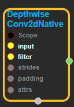
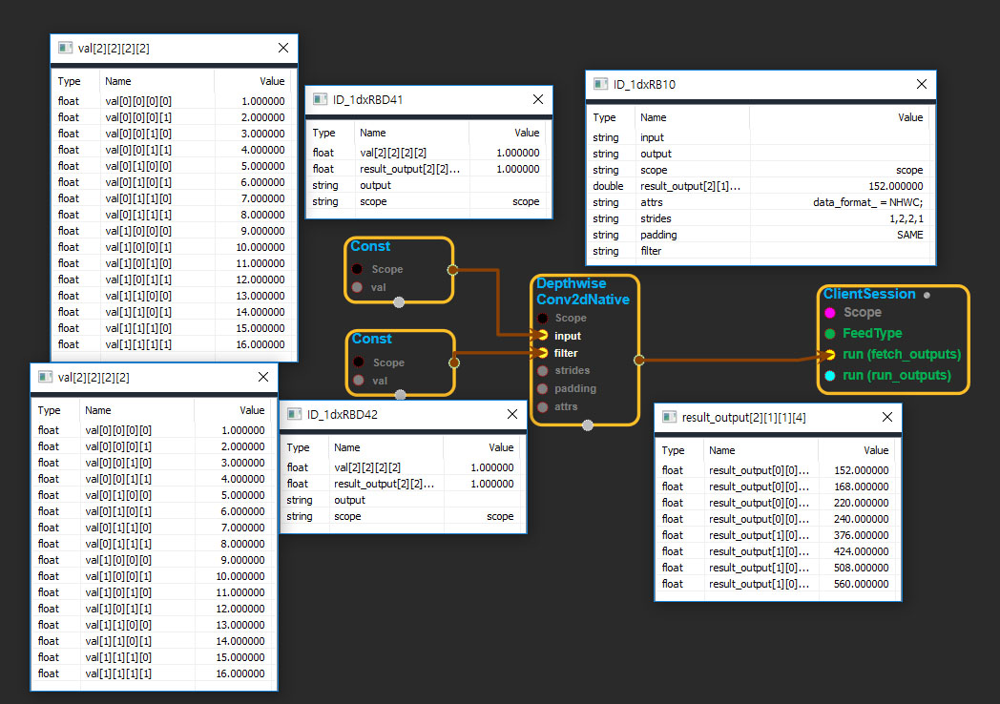

--- 
layout: default 
title: DepthwiseConv2dNative 
parent: nn_ops 
grand_parent: enuSpace-Tensorflow API 
last_modified_date: now 
--- 

# DepthwiseConv2dNative

---

## tensorflow C++ API

[tensorflow::ops::DepthwiseConv2dNative](https://www.tensorflow.org/api_docs/cc/class/tensorflow/ops/depthwise-conv2d-native)

Computes a 2-D depthwise convolution given 4-D`input`and`filter`tensors.

---

## Summary

Given an input tensor of shape`[batch, in_height, in_width, in_channels]`and a filter / kernel tensor of shape`[filter_height, filter_width, in_channels, channel_multiplier]`, containing`in_channels`convolutional filters of depth 1,`depthwise_conv2d`applies a different filter to each input channel \(expanding from 1 channel to`channel_multiplier`channels for each\), then concatenates the results together. Thus, the output has`in_channels * channel_multiplier`channels.

\`\`\` for k in 0..in\_channels-1 for q in 0..channel\_multiplier-1 output\[b, i, j, k \* channel\_multiplier + q\] = sum\_{di, dj} input\[b, strides\[1\] \* i + di, strides\[2\] \* j + dj, k\] \* filter\[di, dj, k, q\] \`\`\`

Must have`strides[0] = strides[3] = 1`. For the most common case of the same horizontal and vertices strides,`strides = [1, stride, stride, 1]`.

Arguments:

* scope: A [Scope](https://www.tensorflow.org/api_docs/cc/class/tensorflow/scope.html#classtensorflow_1_1_scope) object
* strides: 1-D of length 4. The stride of the sliding window for each dimension of`input`.
* padding: The type of padding algorithm to use.

Optional attributes \(see[`Attrs`](https://www.tensorflow.org/api_docs/cc/struct/tensorflow/ops/depthwise-conv2d-native/attrs.html#structtensorflow_1_1ops_1_1_depthwise_conv2d_native_1_1_attrs)\):

* data\_format: Specify the data format of the input and output data. With the default format "NHWC", the data is stored in the order of: \[batch, height, width, channels\]. Alternatively, the format could be "NCHW", the data storage order of: \[batch, channels, height, width\].

Returns:

* [`Output`](https://www.tensorflow.org/api_docs/cc/class/tensorflow/output.html#classtensorflow_1_1_output): The output tensor.

---

## DepthwiseConv2dNative  block

Source link : [https://github.com/EXPNUNI/enuSpaceTensorflow/blob/master/enuSpaceTensorflow/tf\_nn.cpp](https://github.com/EXPNUNI/enuSpaceTensorflow/blob/master/enuSpaceTensorflow/tf_random.cpp)

Argument:

* Scope scope : A Scope object \(A scope is generated automatically each page. A scope is not connected.\)
* Input input: connect  Input node.
* Input filter: connect  Input node.
* gtl::ArraySlice&lt; int &gt; strides: Input strides in value ex\)1,2,2,1
* StringPiece padding: Input paddingin value ex\)SAME
* DepthwiseConv2dNative  ::Attrs attrs : Input attrs in value. ex\) data\_format\_ = NHWC;

Return:

* Output output : Output object of DepthwiseConv2dNative class object.

Result:

* std::vector\(Tensor\) _result\_output_ : Returned object of executed result by calling session.

---

## Using Method

