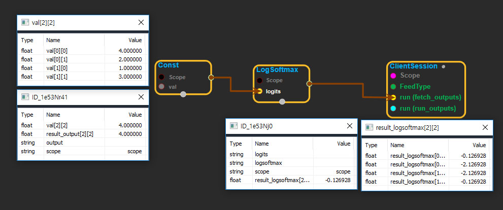

--- 
layout: default 
title: LogSoftmax 
parent: nn_ops 
grand_parent: enuSpace-Tensorflow API 
last_modified_date: now 
--- 

# LogSoftmax

---

## tensorflow C++ API

[tensorflow::ops::LogSoftmax](https://www.tensorflow.org/api_docs/cc/class/tensorflow/ops/log-softmax)

Computes log softmax activations.

---

## Summary

For each batch`i`and class`j`we have

```
logsoftmax[i, j] = logits[i, j] - log(sum(exp(logits[i])))
```

Arguments:

* scope: A [Scope](https://www.tensorflow.org/api_docs/cc/class/tensorflow/scope.html#classtensorflow_1_1_scope)object
* logits: 2-D with shape`[batch_size, num_classes]`.

Returns:

* [`Output`](https://www.tensorflow.org/api_docs/cc/class/tensorflow/output.html#classtensorflow_1_1_output): Same shape as`logits`.

---

## LogSoftmax block

Source link : [https://github.com/EXPNUNI/enuSpaceTensorflow/blob/master/enuSpaceTensorflow/tf\_nn.cpp](https://github.com/EXPNUNI/enuSpaceTensorflow/blob/master/enuSpaceTensorflow/tf_random.cpp)


Argument:

* Scope scope : A Scope object \(A scope is generated automatically each page. A scope is not connected.\)
* Input logits: connect  Input node.

Return:

* Output output: Output object of LRN class object.

Result:

* std::vector\(Tensor\) result\_output  : Returned object of executed result by calling session.

---

## Using Method



