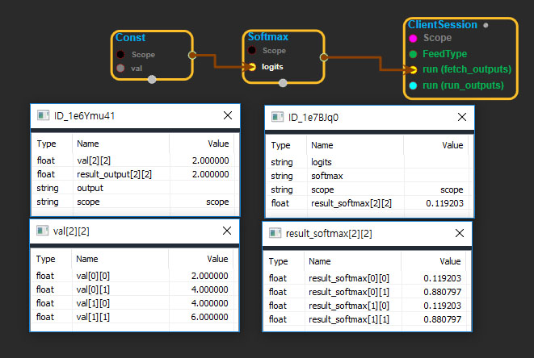

--- 
layout: default 
title: Softmax 
parent: nn_ops 
grand_parent: enuSpace-Tensorflow API 
last_modified_date: now 
--- 

# Softmax

---

## tensorflow C++ API

[tensorflow::ops::Softmax](https://www.tensorflow.org/api_docs/cc/class/tensorflow/ops/softmax)

Computes softmax activations.

---

## Summary

tensorflow::ops::Softmax Class Reference  \|  TensorFlow

For each batch `i` and class `j` we havesoftmax\[i, j\]= exp\(logits\[i, j\]\)/ sum\_j\(exp\(logits\[i, j\]\)\)

Arguments:

* scope: A [Scope](https://www.tensorflow.org/api_docs/cc/class/tensorflow/scope.html#classtensorflow_1_1_scope) object
* logits: 2-D with shape `[batch_size, num_classes]`.

Returns:

* [`Output`](https://www.tensorflow.org/api_docs/cc/class/tensorflow/output.html#classtensorflow_1_1_output): Same shape as `logits`.

---

## Softmax block

Source link : [https://github.com/EXPNUNI/enuSpaceTensorflow/blob/master/enuSpaceTensorflow/tf\_nn.cpp](https://github.com/EXPNUNI/enuSpaceTensorflow/blob/master/enuSpaceTensorflow/tf_random.cpp)

Argument:

* Scope scope : A Scope object \(A scope is generated automatically each page. A scope is not connected.\)
* Input logits: connect  Input node.

Return:

* Output softmax: Output object of Softmax class object.

Result:

* std::vector\(Tensor\) result\_softmax : Returned object of executed result by calling session.

---

## Using Method

