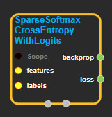
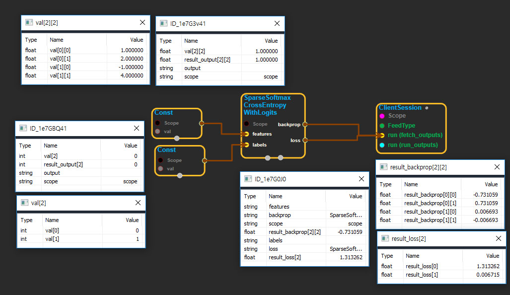

--- 
layout: default 
title: SparseSoftmaxCrossEntropyWithLogits 
parent: nn_ops 
grand_parent: enuSpace-Tensorflow API 
last_modified_date: now 
--- 

# SparseSoftmaxCrossEntropyWithLogits

---

## tensorflow C++ API

[tensorflow::ops::SparseSoftmaxCrossEntropyWithLogits](https://www.tensorflow.org/api_docs/cc/class/tensorflow/ops/sparse-softmax-cross-entropy-with-logits)

Computes softmax cross entropy cost and gradients to backpropagate.

---

## Summary

Unlike[`SoftmaxCrossEntropyWithLogits`](https://www.tensorflow.org/api_docs/cc/class/tensorflow/ops/softmax-cross-entropy-with-logits.html#classtensorflow_1_1ops_1_1_softmax_cross_entropy_with_logits), this operation does not accept a matrix of label probabilities, but rather a single label per row of features. This label is considered to have probability 1.0 for the given row.

Inputs are the logits, not probabilities.

Arguments:

* scope: A [Scope](https://www.tensorflow.org/api_docs/cc/class/tensorflow/scope.html#classtensorflow_1_1_scope) object
* features: batch\_size x num\_classes matrix
* labels: batch\_size vector with values in \[0, num\_classes\). This is the label for the given minibatch entry.

Returns:

* [`Output`](https://www.tensorflow.org/api_docs/cc/class/tensorflow/output.html#classtensorflow_1_1_output)loss: Per example loss \(batch\_size vector\).
* [`Output`](https://www.tensorflow.org/api_docs/cc/class/tensorflow/output.html#classtensorflow_1_1_output)backprop: backpropagated gradients \(batch\_size x num\_classes matrix\).

---

## SparseSoftmaxCrossEntropyWithLogits block

Source link : [https://github.com/EXPNUNI/enuSpaceTensorflow/blob/master/enuSpaceTensorflow/tf\_nn.cpp](https://github.com/EXPNUNI/enuSpaceTensorflow/blob/master/enuSpaceTensorflow/tf_random.cpp)

Argument:

* Scope scope : A Scope object \(A scope is generated automatically each page. A scope is not connected.\)
* Input features: connect  Input node.
* Input labels: connect  Input node.

Return:

* Output loss: Output object of SparseSoftmaxCrossEntropyWithLogits class object.
* Output backprop: Output object of SparseSoftmaxCrossEntropyWithLogits class object.

Result:

* std::vector\(Tensor\) result\_loss: Returned object of executed result by calling session.
* std::vector\(Tensor\) result\_backprop: Returned object of executed result by calling session.

---

## Using Method

