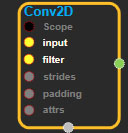
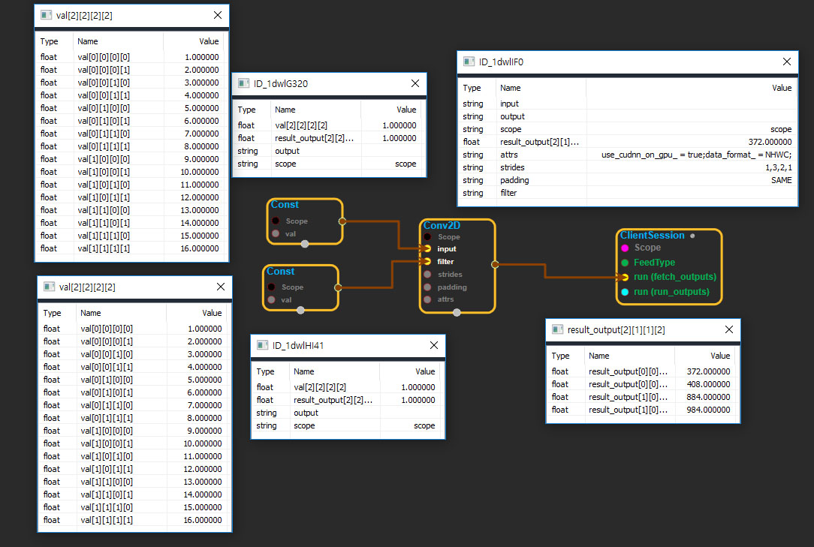

--- 
layout: default 
title: Conv2D 
parent: nn_ops 
grand_parent: enuSpace-Tensorflow API 
last_modified_date: now 
--- 

# Conv2D

---

## tensorflow C++ API

[tensorflow::ops::Conv2D](https://www.tensorflow.org/api_docs/cc/class/tensorflow/ops/conv2-d)

Adds`bias`to`value`.

---

## Summary

Given an input tensor of shape`[batch, in_height, in_width, in_channels]`and a filter / kernel tensor of shape`[filter_height, filter_width, in_channels, out_channels]`, this op performs the following:

1. Flattens the filter to a 2-D matrix with shape
   `[filter_height * filter_width * in_channels, output_channels]`
   .
2. Extracts image patches from the input tensor to form a
   virtual
   tensor of shape
   `[batch, out_height, out_width, filter_height * filter_width * in_channels]`
   .
3. For each patch, right-multiplies the filter matrix and the image patch vector.

In detail, with the default NHWC format,

```
output[b, i, j, k]=
    sum_{di, dj, q} input[b, strides[1]* i + di, strides[2]* j + dj, q]*
                    filter[di, dj, q, k]
```

Must have`strides[0] = strides[3] = 1`. For the most common case of the same horizontal and vertices strides,`strides = [1, stride, stride, 1]`.

Arguments:

* scope: A [Scope](https://www.tensorflow.org/api_docs/cc/class/tensorflow/scope.html#classtensorflow_1_1_scope) object
* input: A 4-D tensor. The dimension order is interpreted according to the value of`data_format`, see below for details.
* filter: A 4-D tensor of shape`[filter_height, filter_width, in_channels, out_channels]`
* strides: 1-D tensor of length 4. The stride of the sliding window for each dimension of`input`. The dimension order is determined by the value of`data_format`, see below for details.
* padding: The type of padding algorithm to use.

Optional attributes \(see[`Attrs`](https://www.tensorflow.org/api_docs/cc/struct/tensorflow/ops/conv2-d/attrs.html#structtensorflow_1_1ops_1_1_conv2_d_1_1_attrs)\):

* data\_format: Specify the data format of the input and output data. With the default format "NHWC", the data is stored in the order of: \[batch, height, width, channels\]. Alternatively, the format could be "NCHW", the data storage order of: \[batch, channels, height, width\].

Returns:

* [`Output`](https://www.tensorflow.org/api_docs/cc/class/tensorflow/output.html#classtensorflow_1_1_output): A 4-D tensor. The dimension order is determined by the value of`data_format`, see below for details.

---

## Conv2D block

Source link : [https://github.com/EXPNUNI/enuSpaceTensorflow/blob/master/enuSpaceTensorflow/tf\_nn.cpp](https://github.com/EXPNUNI/enuSpaceTensorflow/blob/master/enuSpaceTensorflow/tf_random.cpp)



Argument:

* Scope scope : A Scope object \(A scope is generated automatically each page. A scope is not connected.\)
* Input input: connect  Input node.
* Input filter: connect  Input node.
* gtl::ArraySlice&lt; int &gt; strides: Input strides in value ex\)1,2,2,1
* StringPiece padding: Input paddingin value ex\)SAME
* Conv2D ::Attrs attrs : Input attrs in value. ex\) use\_cudnn\_on\_gpu\_ = true;data\_format\_ = NHWC;

Return:

* Output output : Output object of Conv2D class object.

Result:

* std::vector\(Tensor\) _result\_output_ : Returned object of executed result by calling session.

---

## Using Method



