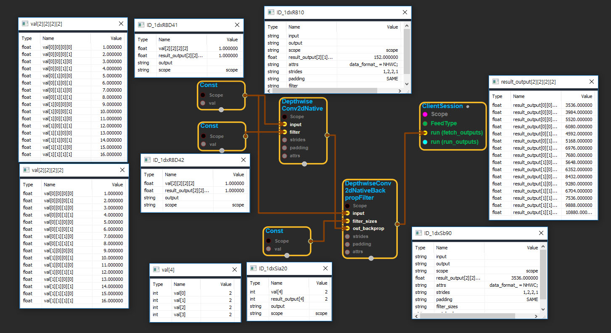

--- 
layout: default 
title: DepthwiseConv2dNativeBackpropFilter 
parent: nn_ops 
grand_parent: enuSpace-Tensorflow API 
last_modified_date: now 
--- 

# DepthwiseConv2dNativeBackpropFilter

---

## tensorflow C++ API

[tensorflow::ops::DepthwiseConv2dNativeBackpropFilter](https://www.tensorflow.org/api_docs/cc/class/tensorflow/ops/depthwise-conv2d-native-backprop-filter)

Computes the gradients of depthwise convolution with respect to the filter.

---

## Summary

Arguments:

* scope: A [Scope](https://www.tensorflow.org/api_docs/cc/class/tensorflow/scope.html#classtensorflow_1_1_scope) object
* input: 4-D with shape based on`data_format`. For example, if`data_format`is 'NHWC' then`input`is a 4-D
  `[batch, in_height, in_width, in_channels]`tensor.
* filter\_sizes: An integer vector representing the tensor shape of`filter`, where`filter`is a 4-D
  `[filter_height, filter_width, in_channels, depthwise_multiplier]`tensor.
* out\_backprop: 4-D with shape based on`data_format`. For example, if`data_format`is 'NHWC' then out\_backprop shape is
  `[batch, out_height, out_width, out_channels]`. Gradients w.r.t. the output of the convolution.
* strides: The stride of the sliding window for each dimension of the input of the convolution.
* padding: The type of padding algorithm to use.

Optional attributes \(see[`Attrs`](https://www.tensorflow.org/api_docs/cc/struct/tensorflow/ops/depthwise-conv2d-native-backprop-filter/attrs.html#structtensorflow_1_1ops_1_1_depthwise_conv2d_native_backprop_filter_1_1_attrs)\):

* data\_format: Specify the data format of the input and output data. With the default format "NHWC", the data is stored in the order of: \[batch, height, width, channels\]. Alternatively, the format could be "NCHW", the data storage order of: \[batch, channels, height, width\].

Returns:

* [`Output`](https://www.tensorflow.org/api_docs/cc/class/tensorflow/output.html#classtensorflow_1_1_output): 4-D with shape`[filter_height, filter_width, in_channels, out_channels]`. Gradient w.r.t. the`filter`input of the convolution.

---

## DepthwiseConv2dNativeBackpropFilter block

Source link : [https://github.com/EXPNUNI/enuSpaceTensorflow/blob/master/enuSpaceTensorflow/tf\_nn.cpp](https://github.com/EXPNUNI/enuSpaceTensorflow/blob/master/enuSpaceTensorflow/tf_random.cpp)

Argument:

* Scope scope : A Scope object \(A scope is generated automatically each page. A scope is not connected.\)
* Input input: connect  Input node.
* Input filter\_sizes: connect  Input node.
* Input out\_backprop: connect  Input node.
* gtl::ArraySlice&lt; int &gt; strides: Input strides in value ex\)1,2,2,1
* StringPiece padding: Input padding in value ex\)SAME
* DepthwiseConv2dNativeBackpropFilter::Attrs attrs : Input attrs in value. ex\) data\_format\_ = NHWC;

Return:

* Output output : Output object of DepthwiseConv2dNativeBackpropFilter class object.

Result:

* std::vector\(Tensor\) _result\_output_ : Returned object of executed result by calling session.

---

## Using Method

