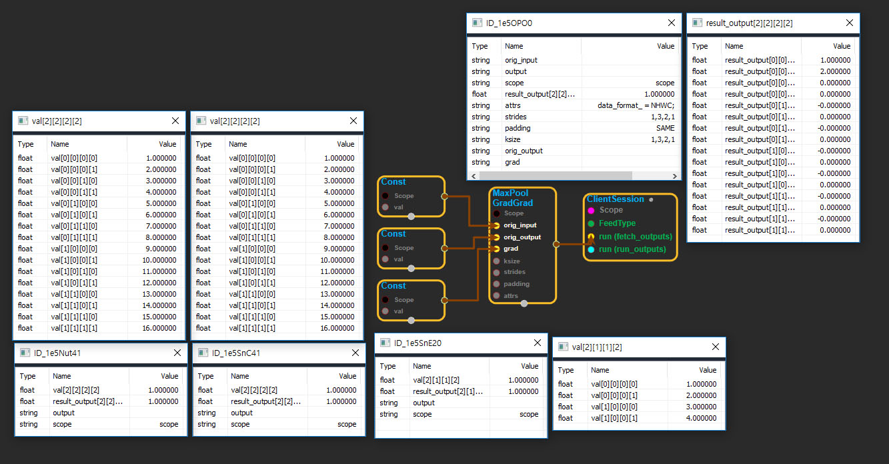

--- 
layout: default 
title: MaxPoolGradGrad 
parent: nn_ops 
grand_parent: enuSpace-Tensorflow API 
last_modified_date: now 
--- 

# MaxPoolGradGrad

---

## tensorflow C++ API

[tensorflow::ops::MaxPoolGradGrad](https://www.tensorflow.org/api_docs/cc/class/tensorflow/ops/max-pool-grad-grad)

Computes second-order gradients of the maxpooling function.

---

## Summary

Arguments:

* scope: A [Scope](https://www.tensorflow.org/api_docs/cc/class/tensorflow/scope.html#classtensorflow_1_1_scope) object
* orig\_input: The original input tensor.
* orig\_output: The original output tensor.
* grad: 4-D. Gradients of gradients w.r.t. the input of`max_pool`.
* ksize: The size of the window for each dimension of the input tensor.
* strides: The stride of the sliding window for each dimension of the input tensor.
* padding: The type of padding algorithm to use.

Optional attributes \(see[`Attrs`](https://www.tensorflow.org/api_docs/cc/struct/tensorflow/ops/max-pool-grad-grad/attrs.html#structtensorflow_1_1ops_1_1_max_pool_grad_grad_1_1_attrs)\):

* data\_format: Specify the data format of the input and output data. With the default format "NHWC", the data is stored in the order of: \[batch, in\_height, in\_width, in\_channels\]. Alternatively, the format could be "NCHW", the data storage order of: \[batch, in\_channels, in\_height, in\_width\].

Returns:

* [`Output`](https://www.tensorflow.org/api_docs/cc/class/tensorflow/output.html#classtensorflow_1_1_output): Gradients of gradients w.r.t. the input to`max_pool`.

---

## MaxPoolGradGrad block

Source link : [https://github.com/EXPNUNI/enuSpaceTensorflow/blob/master/enuSpaceTensorflow/tf\_nn.cpp](https://github.com/EXPNUNI/enuSpaceTensorflow/blob/master/enuSpaceTensorflow/tf_random.cpp)

Argument:

* Scope scope : A Scope object \(A scope is generated automatically each page. A scope is not connected.\)
* Input orig\_input: connect  Input node.
* Input orig\_output: connect  Input node.
* Input grad: connect  Input node.
* ArraySlice&lt; int&gt; ksize: input ksize in values. ex\)1,2,2,2,1
* ArraySlice&lt; int&gt; strides: input ksize in values. ex\)1,4,3,2,1
* stringpiece padding: input padding in value. ex\)SAME
* MaxPoolGradGrad::Attrs attrs: input attrs in values \)data\_format\_ = NHWC;

Return:

* Output output: Output object of MaxPoolGradGrad class object.

Result:

* std::vector\(Tensor\) result\_output  : Returned object of executed result by calling session.

---

## Using Method

