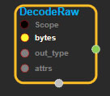
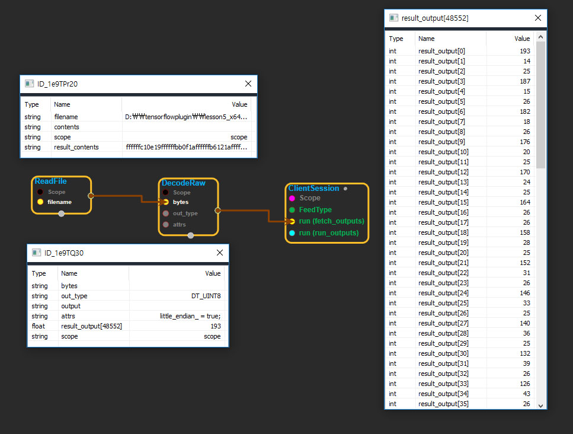

--- 
layout: default 
title: DecodeRaw 
parent: parsing_ops 
grand_parent: enuSpace-Tensorflow API 
last_modified_date: now 
--- 

# DecodeRaw

---

## tensorflow C++ API

[tensorflow::ops::DecodeRaw](https://www.tensorflow.org/api_docs/cc/class/tensorflow/ops/decode-raw)

Reinterpret the bytes of a string as a vector of numbers.

---

## Summary

Arguments:

* scope: A [Scope](https://www.tensorflow.org/api_docs/cc/class/tensorflow/scope.html#classtensorflow_1_1_scope) object
* bytes:[All](https://www.tensorflow.org/api_docs/cc/class/tensorflow/ops/all.html#classtensorflow_1_1ops_1_1_all) the elements must have the same length.

Optional attributes \(see[`Attrs`](https://www.tensorflow.org/api_docs/cc/struct/tensorflow/ops/decode-raw/attrs.html#structtensorflow_1_1ops_1_1_decode_raw_1_1_attrs)\):

* little\_endian: Whether the input `bytes`are in little-endian order. Ignored for `out_type`values that are stored in a single byte like`uint8`.

Returns:

* [`Output`](https://www.tensorflow.org/api_docs/cc/class/tensorflow/output.html#classtensorflow_1_1_output): A [Tensor](https://www.tensorflow.org/api_docs/cc/class/tensorflow/tensor.html#classtensorflow_1_1_tensor) with one more dimension than the input `bytes`. The added dimension will have size equal to the length of the elements of `bytes`divided by the number of bytes to represent `out_type`
  .

---

## DecodeRaw block

Source link : [https://github.com/EXPNUNI/enuSpaceTensorflow/blob/master/enuSpaceTensorflow/tf\_parsing\_op.cpp](https://github.com/EXPNUNI/enuSpaceTensorflow/blob/master/enuSpaceTensorflow/tf_random.cpp)

Argument:

* Scope scope : A Scope object \(A scope is generated automatically each page. A scope is not connected.\)
* Input bytes: connect  Input node.
* DataType out\_type: input DataType in value.
* DecodeRaw::Attrs attrs: input Attrs in value.

Return:

* Output output : Output object of DecodeRaw  class object.

Result:

* std::vector\(Tensor\) \_result\_\_output : Returned object of executed result by calling session.

---

## Using Method

