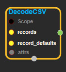
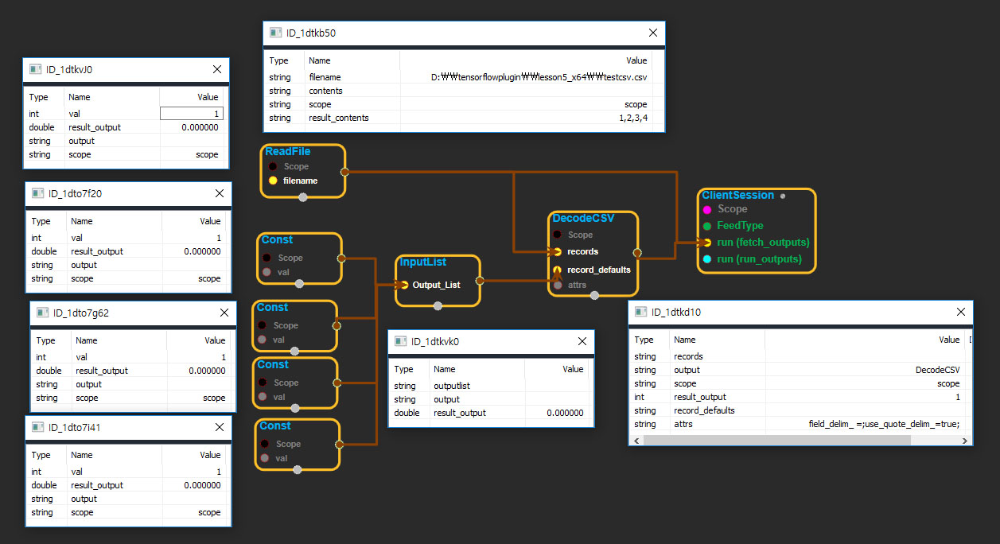

--- 
layout: default 
title: DecodeCSV 
parent: parsing_ops 
grand_parent: enuSpace-Tensorflow API 
last_modified_date: now 
--- 

# DecodeCSV

---

## tensorflow C++ API

[tensorflow::ops::DecodeCSV](https://www.tensorflow.org/api_docs/cc/class/tensorflow/ops/decode-c-s-v)

Convert CSV records to tensors.

---

## Summary

Each column maps to one tensor.

RFC 4180 format is expected for the CSV records. \([https://tools.ietf.org/html/rfc4180](https://tools.ietf.org/html/rfc4180)\) Note that we allow leading and trailing spaces with int or float field.

Arguments:

* scope: A [Scope](https://www.tensorflow.org/api_docs/cc/class/tensorflow/scope.html#classtensorflow_1_1_scope) object
* records: Each string is a record/row in the csv and all records should have the same format.
* record\_defaults: One tensor per column of the input record, with either a scalar default value for that column or empty if the column is required.

Optional attributes \(see[`Attrs`](https://www.tensorflow.org/api_docs/cc/struct/tensorflow/ops/decode-c-s-v/attrs.html#structtensorflow_1_1ops_1_1_decode_c_s_v_1_1_attrs)\):

* field\_delim: char delimiter to separate fields in a record.
* use\_quote\_delim: If false, treats double quotation marks as regular characters inside of the string fields \(ignoring RFC 4180, Section 2, Bullet 5\).

Returns:

* `OutputList`: Each tensor will have the same shape as records..

---

## DecodeCSV block

Source link : [https://github.com/EXPNUNI/enuSpaceTensorflow/blob/master/enuSpaceTensorflow/tf\_parsing\_op.cpp](https://github.com/EXPNUNI/enuSpaceTensorflow/blob/master/enuSpaceTensorflow/tf_random.cpp)

Argument:

* Scope scope : A Scope object \(A scope is generated automatically each page. A scope is not connected.\)
* Input records: connect  Input node.
* Input record\_defaults: connect  Input node.
* DecodeCSV ::Attrs attrs: input attrs in values ex\)field\_delim\_ =;use\_quote\_delim\_=true;

Return:

* Output output : Output object of DecodeCSV class object.

Result:

* std::vector\(Tensor\) _result\_output_ : Returned object of executed result by calling session.

---

## Using Method

