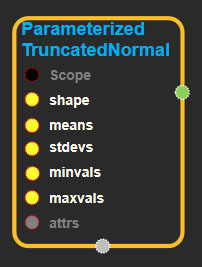
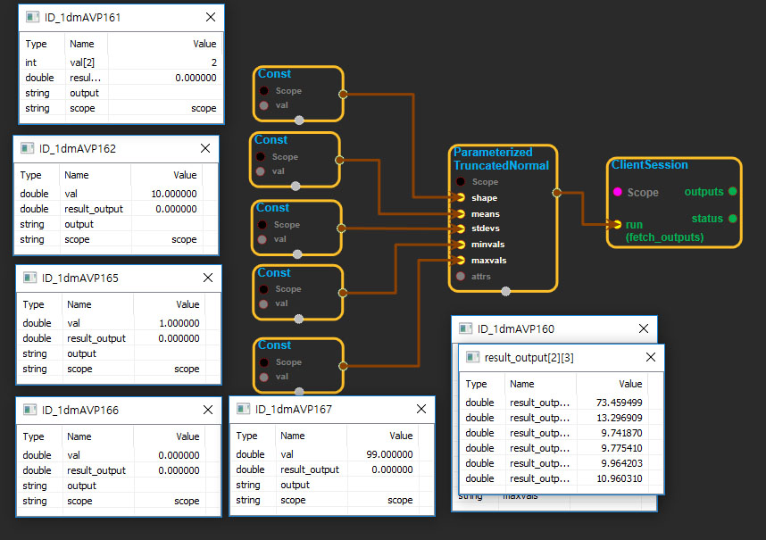

--- 
layout: default 
title: ParameterizedTruncatedNormal 
parent: random_ops 
grand_parent: enuSpace-Tensorflow API 
last_modified_date: now 
--- 

# ParameterizedTruncatedNormal

---

## tensorflow C++ API

[tensorflow::ops::ParameterizedTruncatedNormal](https://www.tensorflow.org/api_docs/cc/class/tensorflow/ops/parameterized-truncated-normal)

Outputs random values from a normal distribution.

---

## Summary

The parameters may each be a

scalar which applies to the entire output, or a vector of length shape\[0\] which stores the parameters for each batch.

Arguments:

* scope: A [Scope](https://www.tensorflow.org/api_docs/cc/class/tensorflow/scope.html#classtensorflow_1_1_scope) object
* shape: The shape of the output tensor. Batches are indexed by the 0th dimension.
* means: The mean parameter of each batch.
* stdevs: The standard deviation parameter of each batch. Must be greater than 0.
* minvals: The minimum cutoff. May be -infinity.
* maxvals: The maximum cutoff. May be +infinity, and must be more than the minval for each batch.

Optional attributes \(see [`Attrs`](https://www.tensorflow.org/api_docs/cc/struct/tensorflow/ops/parameterized-truncated-normal/attrs.html#structtensorflow_1_1ops_1_1_parameterized_truncated_normal_1_1_attrs)\):

* seed: If either `seed` or `seed2` are set to be non-zero, the random number generator is seeded by the given seed. Otherwise, it is seeded by a random seed.
* seed2: A second seed to avoid seed collision.

Returns:

* [`Output`](https://www.tensorflow.org/api_docs/cc/class/tensorflow/output.html#classtensorflow_1_1_output)
  : A matrix of shape num\_batches x samples\_per\_batch, filled with random truncated normal values using the parameters for each row.

---

## ParameterizedTruncatedNormal block

Source link : [https://github.com/EXPNUNI/enuSpaceTensorflow/blob/master/enuSpaceTensorflow/tf\_random.cpp](https://github.com/EXPNUNI/enuSpaceTensorflow/blob/master/enuSpaceTensorflow/tf_random.cpp)

Argument:

* Scope scope : A Scope object \(A scope is generated automatically each page. A scope is not connected.\)
* Input shape: connect  Input node.
* Input means : connect Input node.
* Input stdevs: connect  Input node.
* Input means : connect Input node.
* Input minvals: connect  Input node
* Input maxvals: connect Input node.
* ParameterizedTruncatedNormal ::Attrs attrs : Input attrs in value. ex\) seed\_ = 0;seed2\_ = 0;

Return:

* Output output : Output object of ParameterizedTruncatedNormal class object.

Result:

* std::vector\(Tensor\) product\_result : Returned object of executed result by calling session.

---

## Using Method

