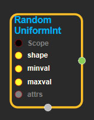

--- 
layout: default 
title: RandomUniformInt 
parent: random_ops 
grand_parent: enuSpace-Tensorflow API 
last_modified_date: now 
--- 

# RandomUniformInt

---

## tensorflow C++ API

[tensorflow::ops::RandomUniformInt](tensorflow::ops::RandomUniformInt)

Outputs random integers from a uniform distribution.

---

## Summary

The generated values are uniform integers in the range `[minval, maxval)`. The lower bound `minval` is included in the range, while the upper bound `maxval` is excluded.

The random integers are slightly biased unless `maxval - minval` is an exact power of two. The bias is small for values of `maxval - minval` significantly smaller than the range of the output \(either `2^32` or `2^64`\).

Arguments:

* scope: A [Scope](https://www.tensorflow.org/api_docs/cc/class/tensorflow/scope.html#classtensorflow_1_1_scope) object
* shape: The shape of the output tensor.
* minval: 0-D. Inclusive lower bound on the generated integers.
* maxval: 0-D. Exclusive upper bound on the generated integers.

Optional attributes \(see [`Attrs`](https://www.tensorflow.org/api_docs/cc/struct/tensorflow/ops/random-uniform-int/attrs.html#structtensorflow_1_1ops_1_1_random_uniform_int_1_1_attrs)\):

* seed: If either `seed` or `seed2` are set to be non-zero, the random number generator is seeded by the given seed. Otherwise, it is seeded by a random seed.
* seed2: A second seed to avoid seed collision.

Returns:

* [`Output`](https://www.tensorflow.org/api_docs/cc/class/tensorflow/output.html#classtensorflow_1_1_output)
  : A tensor of the specified shape filled with uniform random integers.

---

## RandomUniformInt block

Source link : [https://github.com/EXPNUNI/enuSpaceTensorflow/blob/master/enuSpaceTensorflow/tf\_random.cpp](https://github.com/EXPNUNI/enuSpaceTensorflow/blob/master/enuSpaceTensorflow/tf_random.cpp)

Argument:

* Scope scope : A Scope object \(A scope is generated automatically each page. A scope is not connected.\)
* Input shape: connect  Input node.
* Input minval: connect  Input node.
* Input maxval: connect  Input node.
* RandomUniformInt::Attrs attrs : Input attrs in value. ex\) seed\_ = 0;seed2\_ = 0;

Return:

* Output output : Output object of RandomUniformInt class object.

Result:

* std::vector\(Tensor\) product\_result : Returned object of executed result by calling session.

---

## Using Method

