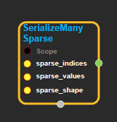
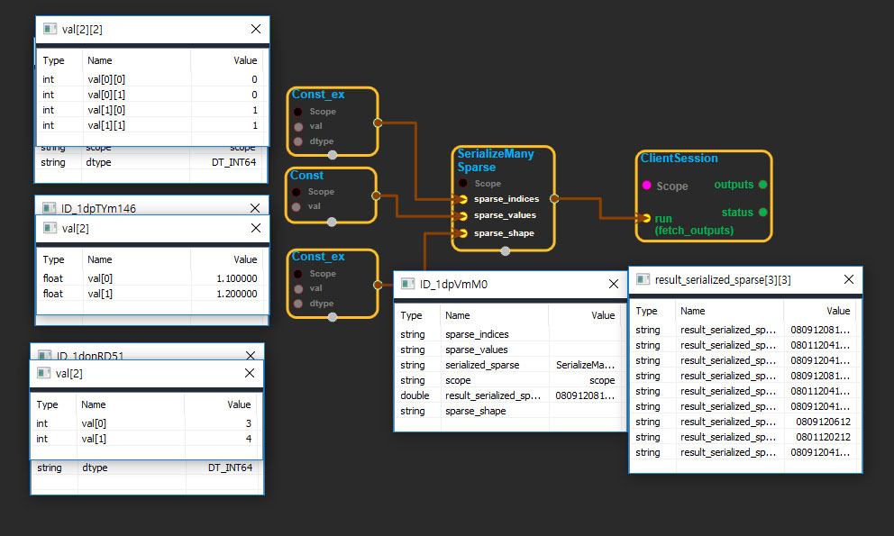

# SerializeManySparse

---

## tensorflow C++ API

[tensorflow::ops::SerializeManySparse](https://www.tensorflow.org/api_docs/cc/class/tensorflow/ops/serialize-many-sparse)

Deserialize and concatenate `SparseTensors` from a serialized minibatch.

---

## Summary

The `SparseTensor` must have rank `R` greater than 1, and the first dimension is treated as the minibatch dimension. Elements of the `SparseTensor` must be sorted in increasing order of this first dimension. The serialized `SparseTensor` objects going into each row of `serialized_sparse` will have rank `R-1`.

The minibatch size `N` is extracted from `sparse_shape[0]`.

Arguments:

* scope: A [Scope](https://www.tensorflow.org/api_docs/cc/class/tensorflow/scope.html#classtensorflow_1_1_scope) object
* sparse\_indices: 2-D. The `indices` of the minibatch `SparseTensor`.
* sparse\_values: 1-D. The `values` of the minibatch `SparseTensor`.
* sparse\_shape: 1-D. The `shape` of the minibatch `SparseTensor`.

Returns:

* [`Output`](https://www.tensorflow.org/api_docs/cc/class/tensorflow/output.html#classtensorflow_1_1_output): The serialized\_sparse tensor.

---

## SerializeManySparse block

Source link : [https://github.com/EXPNUNI/enuSpaceTensorflow/blob/master/enuSpaceTensorflow/tf\_sparse.cpp](https://github.com/EXPNUNI/enuSpaceTensorflow/blob/master/enuSpaceTensorflow/tf_sparse.cpp)

Argument:

* Scope scope : A Scope object \(A scope is generated automatically each page. A scope is not connected.\)
* Input sparse\_indices: connect  Input node.
* Input sparse\_values: connect  Input node.
* Input sparse\_shape: connect  Input node.

Return:

* Output output: Output object of SerializeManySparse class object.

Result:

* std::vector\(Tensor\) product\_result : Returned object of executed result by calling session.

---

## Using Method

