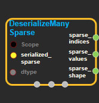
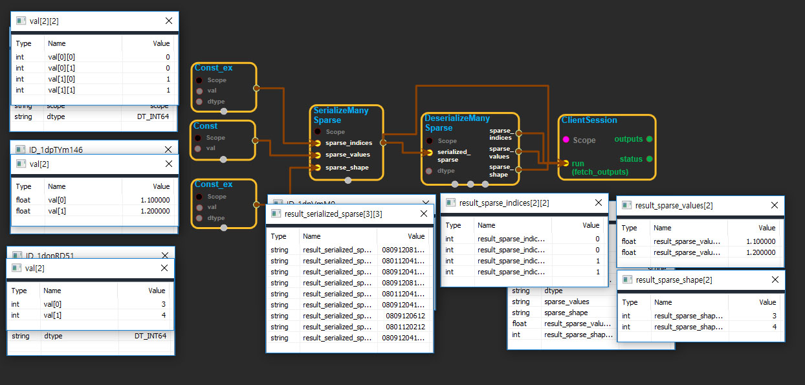

--- 
layout: default 
title: DeserializeManySparse 
parent: sparse_ops 
grand_parent: enuSpace-Tensorflow API 
last_modified_date: now 
--- 

# DeserializeManySparse

---

## tensorflow C++ API

[tensorflow::ops::DeserializeManySparse](https://www.tensorflow.org/api_docs/cc/class/tensorflow/ops/deserialize-many-sparse)

Deserialize and concatenate `SparseTensors` from a serialized minibatch.

---

## Summary

The input `serialized_sparse` must be a string matrix of shape `[N x 3]` where `N` is the minibatch size and the rows correspond to packed outputs of [`SerializeSparse`](https://www.tensorflow.org/api_docs/cc/class/tensorflow/ops/serialize-sparse.html#classtensorflow_1_1ops_1_1_serialize_sparse). The ranks of the original `SparseTensor` objects must all match. When the final `SparseTensor` is created, it has rank one higher than the ranks of the incoming `SparseTensor` objects \(they have been concatenated along a new row dimension\).

The output `SparseTensor` object's shape values for all dimensions but the first are the max across the input `SparseTensor` objects' shape values for the corresponding dimensions. Its first shape value is `N`, the minibatch size.

The input `SparseTensor` objects' indices are assumed ordered in standard lexicographic order. If this is not the case, after this step run [`SparseReorder`](https://www.tensorflow.org/api_docs/cc/class/tensorflow/ops/sparse-reorder.html#classtensorflow_1_1ops_1_1_sparse_reorder) to restore index ordering.

For example, if the serialized input is a `[2 x 3]` matrix representing two original `SparseTensor` objects:

```
index =[0]
       [10]
       [20]

values =[1,2,3]

shape =[50]
```

and

```
index =[2]
       [10]

values =[4,5]

shape =[30]
```

then the final deserialized `SparseTensor` will be:

```
index =[0 0]
       [0 10]
       [0 20]
       [1  2]
       [1 10]

values =[1,2,3,4,5]

shape =[2 50]
```

Arguments:

* scope: A [Scope](https://www.tensorflow.org/api_docs/cc/class/tensorflow/scope.html#classtensorflow_1_1_scope) object
* serialized\_sparse: 2-D, The `N` serialized `SparseTensor` objects. Must have 3 columns.
* dtype: The `dtype` of the serialized `SparseTensor` objects.

Returns:

* [`Output`](https://www.tensorflow.org/api_docs/cc/class/tensorflow/output.html#classtensorflow_1_1_output) sparse\_indices
* [`Output`](https://www.tensorflow.org/api_docs/cc/class/tensorflow/output.html#classtensorflow_1_1_output) sparse\_values
* [`Output`](https://www.tensorflow.org/api_docs/cc/class/tensorflow/output.html#classtensorflow_1_1_output) sparse\_shape

---

## DeserializeManySparse block

Source link : [https://github.com/EXPNUNI/enuSpaceTensorflow/blob/master/enuSpaceTensorflow/tf\_sparse.cpp](https://github.com/EXPNUNI/enuSpaceTensorflow/blob/master/enuSpaceTensorflow/tf_sparse.cpp)



Argument:

* Scope scope : A Scope object \(A scope is generated automatically each page. A scope is not connected.\)
* Input serialized\_sparse: connect  Input node.
* DataType dtype: input DataType in value.

Return:

* Output sparse\_indices: Output object of DeserializeManySparse class object.
* Output sparse\_values: Output object of DeserializeManySparse class object.
* Output sparse\_shape: Output object of DeserializeManySparse class object.

Result:

* std::vector\(Tensor\) product\_result : Returned object of executed result by calling session.

---

## Using Method



