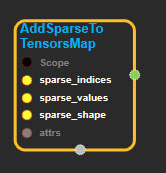
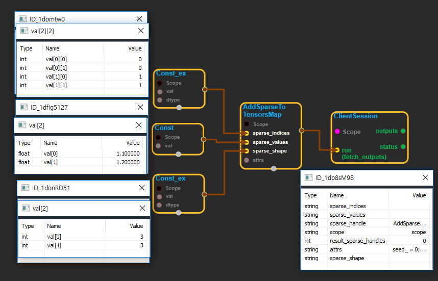

--- 
layout: default 
title: AddSparseToTensorsMap 
parent: sparse_ops 
grand_parent: enuSpace-Tensorflow API 
last_modified_date: now 
--- 

# AddSparseToTensorsMap

---

## tensorflow C++ API

[tensorflow::ops::AddSparseToTensorsMap](https://www.tensorflow.org/api_docs/cc/class/tensorflow/ops/add-sparse-to-tensors-map)

[Add](https://www.tensorflow.org/api_docs/cc/class/tensorflow/ops/add.html#classtensorflow_1_1ops_1_1_add) a `SparseTensor` to a `SparseTensorsMap` return its handle.

---

## Summary

A `SparseTensor` is represented by three tensors: `sparse_indices`, `sparse_values`, and `sparse_shape`.

This operator takes the given `SparseTensor` and adds it to a container object \(a `SparseTensorsMap`\). A unique key within this container is generated in the form of an `int64`, and this is the value that is returned.

The `SparseTensor` can then be read out as part of a minibatch by passing the key as a vector element to [`TakeManySparseFromTensorsMap`](https://www.tensorflow.org/api_docs/cc/class/tensorflow/ops/take-many-sparse-from-tensors-map.html#classtensorflow_1_1ops_1_1_take_many_sparse_from_tensors_map). To ensure the correct `SparseTensorsMap` is accessed, ensure that the same `container` and `shared_name` are passed to that Op. If no `shared_name` is provided here, instead use the name of the [Operation](https://www.tensorflow.org/api_docs/cc/class/tensorflow/operation.html#classtensorflow_1_1_operation) created by calling [`AddSparseToTensorsMap`](https://www.tensorflow.org/api_docs/cc/class/tensorflow/ops/add-sparse-to-tensors-map.html#classtensorflow_1_1ops_1_1_add_sparse_to_tensors_map) as the `shared_name` passed to [`TakeManySparseFromTensorsMap`](https://www.tensorflow.org/api_docs/cc/class/tensorflow/ops/take-many-sparse-from-tensors-map.html#classtensorflow_1_1ops_1_1_take_many_sparse_from_tensors_map). Ensure the Operations are colocated.

Arguments:

* scope: A [Scope](https://www.tensorflow.org/api_docs/cc/class/tensorflow/scope.html#classtensorflow_1_1_scope) object
* sparse\_indices: 2-D. The `indices` of the `SparseTensor`.
* sparse\_values: 1-D. The `values` of the `SparseTensor`.
* sparse\_shape: 1-D. The `shape` of the `SparseTensor`.

Optional attributes \(see [`Attrs`](https://www.tensorflow.org/api_docs/cc/struct/tensorflow/ops/add-sparse-to-tensors-map/attrs.html#structtensorflow_1_1ops_1_1_add_sparse_to_tensors_map_1_1_attrs)\):

* container: The container name for the `SparseTensorsMap` created by this op.
* shared\_name: The shared name for the `SparseTensorsMap` created by this op. If blank, the new [Operation](https://www.tensorflow.org/api_docs/cc/class/tensorflow/operation.html#classtensorflow_1_1_operation)'s unique name is used.

Returns:

* [`Output`](https://www.tensorflow.org/api_docs/cc/class/tensorflow/output.html#classtensorflow_1_1_output): 0-D. The handle of the`SparseTensor` now stored in the `SparseTensorsMap`.

---

## AddSparseToTensorsMap block

Source link : [https://github.com/EXPNUNI/enuSpaceTensorflow/blob/master/enuSpaceTensorflow/tf\_sparse.cpp](https://github.com/EXPNUNI/enuSpaceTensorflow/blob/master/enuSpaceTensorflow/tf_sparse.cpp)

Argument:

* Scope scope : A Scope object \(A scope is generated automatically each page. A scope is not connected.\)
* Input sparse\_indices: connect  Input node.
* Input sparse\_values: connect Input node.
* Input sparse\_shape: connect Input node.
* AddSparseToTensorsMap::Attrs attrs : Input attrs in value. ex\) container\_= ;shared\_name\_= ;

Return:

* Output output : Output object of AddSparseToTensorsMap class object.

Result:

* std::vector\(Tensor\) product\_result : Returned object of executed result by calling session.

---

## Using Method

