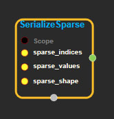
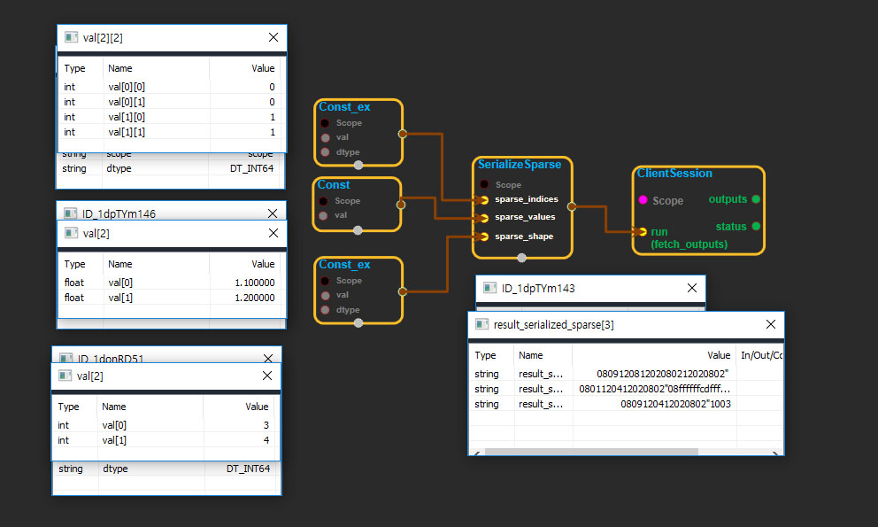

--- 
layout: default 
title: SerializeSparse 
parent: sparse_ops 
grand_parent: enuSpace-Tensorflow API 
last_modified_date: now 
--- 

# SerializeSparse

---

## tensorflow C++ API

[tensorflow::ops::SerializeSparse](https://www.tensorflow.org/api_docs/cc/class/tensorflow/ops/serialize-sparse)

Serialize a `SparseTensor` into a string 3-vector \(1-D [`Tensor`](https://www.tensorflow.org/api_docs/cc/class/tensorflow/tensor.html#classtensorflow_1_1_tensor)\) object.

---

## Summary

Arguments:

* scope: A [Scope](https://www.tensorflow.org/api_docs/cc/class/tensorflow/scope.html#classtensorflow_1_1_scope) object
* sparse\_indices: 2-D. The `indices` of the `SparseTensor`.
* sparse\_values: 1-D. The `values` of the `SparseTensor`.
* sparse\_shape: 1-D. The `shape` of the `SparseTensor`.

Returns:

* [`Output`](https://www.tensorflow.org/api_docs/cc/class/tensorflow/output.html#classtensorflow_1_1_output): The serialized\_sparse tensor.

---

## SerializeSparse block

Source link : [https://github.com/EXPNUNI/enuSpaceTensorflow/blob/master/enuSpaceTensorflow/tf\_sparse.cpp](https://github.com/EXPNUNI/enuSpaceTensorflow/blob/master/enuSpaceTensorflow/tf_sparse.cpp)

Argument:

* Scope scope : A Scope object \(A scope is generated automatically each page. A scope is not connected.\)
* Input sparse\_indices: connect  Input node.
* Input sparse\_values: connect  Input node.
* Input sparse\_shape: connect  Input node.

Return:

* Output output: Output object of SerializeSparse class object.

Result:

* std::vector\(Tensor\) product\_result : Returned object of executed result by calling session.

---

## Using Method

