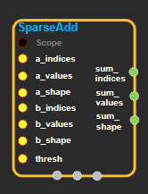
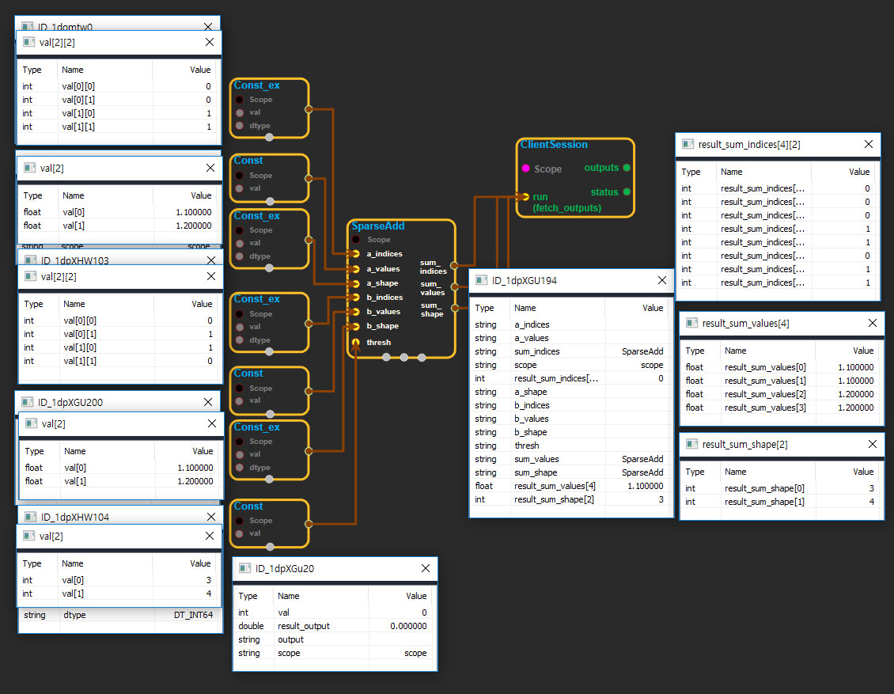

--- 
layout: default 
title: SparseAdd 
parent: sparse_ops 
grand_parent: enuSpace-Tensorflow API 
last_modified_date: now 
--- 

# SparseAdd

---

## tensorflow C++ API

[tensorflow::ops::SparseAdd](https://www.tensorflow.org/api_docs/cc/class/tensorflow/ops/sparse-add)

Adds two `SparseTensor` objects to produce another `SparseTensor`

---

## Summary

The input `SparseTensor` objects' indices are assumed ordered in standard lexicographic order. If this is not the case, before this step run [`SparseReorder`](https://www.tensorflow.org/api_docs/cc/class/tensorflow/ops/sparse-reorder.html#classtensorflow_1_1ops_1_1_sparse_reorder) to restore index ordering.

By default, if two values sum to zero at some index, the output `SparseTensor` would still include that particular location in its index, storing a zero in the corresponding value slot. To override this, callers can specify `thresh`, indicating that if the sum has a magnitude strictly smaller than `thresh`, its corresponding value and index would then not be included. In particular, `thresh == 0` \(default\) means everything is kept and actual thresholding happens only for a positive value.

In the following shapes, `nnz` is the count after taking `thresh` into account.

Arguments:

* scope: A [Scope](https://www.tensorflow.org/api_docs/cc/class/tensorflow/scope.html#classtensorflow_1_1_scope) object
* a\_indices: 2-D. The `indices` of the first `SparseTensor`, size `[nnz, ndims]` Matrix.
* a\_values: 1-D. The `values` of the first `SparseTensor`, size `[nnz]` Vector.
* a\_shape: 1-D. The `shape` of the first `SparseTensor`, size `[ndims]` Vector.
* b\_indices: 2-D. The `indices` of the second `SparseTensor`, size `[nnz, ndims]` Matrix.
* b\_values: 1-D. The `values` of the second `SparseTensor`, size `[nnz]` Vector.
* b\_shape: 1-D. The `shape` of the second `SparseTensor`, size `[ndims]` Vector.
* thresh: 0-D. The magnitude threshold that determines if an output value/index pair takes space.

Returns:

* [`Output`](https://www.tensorflow.org/api_docs/cc/class/tensorflow/output.html#classtensorflow_1_1_output) sum\_indices
* [`Output`](https://www.tensorflow.org/api_docs/cc/class/tensorflow/output.html#classtensorflow_1_1_output) sum\_values
* [`Output`](https://www.tensorflow.org/api_docs/cc/class/tensorflow/output.html#classtensorflow_1_1_output) sum\_shape

---

## SparseAdd block

Source link : [https://github.com/EXPNUNI/enuSpaceTensorflow/blob/master/enuSpaceTensorflow/tf\_sparse.cpp](https://github.com/EXPNUNI/enuSpaceTensorflow/blob/master/enuSpaceTensorflow/tf_sparse.cpp)

Argument:

* Scope scope : A Scope object \(A scope is generated automatically each page. A scope is not connected.\)
* Input a\_indices: connect  Input node.
* Input a\_values: connect  Input node.
* Input a\_shape: connect  Input node.
* Input b\_indices: connect  Input node.
* Input b\_values: connect  Input node.
* Input b\_shape: connect  Input node.
* Input thresh: connect  Input node.

Return:

* Output sum\_indices: Output object of SparseAdd class object.
* Output sum\_values: Output object of SparseAdd class object.
* Output sum\_shape: Output object of SparseAdd class object.

Result:

* std::vector\(Tensor\) product\_result : Returned object of executed result by calling session.

---

## Using Method

