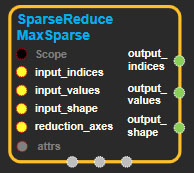
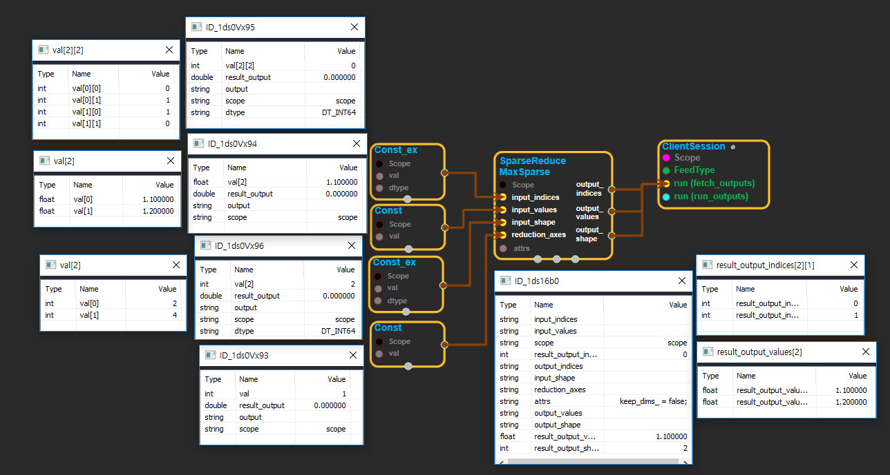

--- 
layout: default 
title: SparseReduceMaxSparse 
parent: sparse_ops 
grand_parent: enuSpace-Tensorflow API 
last_modified_date: now 
--- 

# SparseReduceMaxSparse

---

## tensorflow C++ API

[tensorflow::ops::SparseReduceMaxSparse](https://www.tensorflow.org/api_docs/cc/class/tensorflow/ops/sparse-reduce-max-sparse)

Computes the max of elements across dimensions of a SparseTensor.

---

## Summary

This Op takes a SparseTensor and is the sparse counterpart to`tf.reduce_max()`. In contrast to[SparseReduceMax](https://www.tensorflow.org/api_docs/cc/class/tensorflow/ops/sparse-reduce-max.html#classtensorflow_1_1ops_1_1_sparse_reduce_max), this Op returns a SparseTensor.

Reduces`sp_input`along the dimensions given in`reduction_axes`. Unless`keep_dims`is true, the rank of the tensor is reduced by 1 for each entry in`reduction_axes`. If`keep_dims`is true, the reduced dimensions are retained with length 1.

If`reduction_axes`has no entries, all dimensions are reduced, and a tensor with a single element is returned. Additionally, the axes can be negative, which are interpreted according to the indexing rules in Python.

Arguments:

* scope: A [Scope](https://www.tensorflow.org/api_docs/cc/class/tensorflow/scope.html#classtensorflow_1_1_scope) object
* input\_indices: 2-D.`N x R`matrix with the indices of non-empty values in a SparseTensor, possibly not in canonical ordering.
* input\_values: 1-D.`N`non-empty values corresponding to`input_indices`.
* input\_shape: 1-D.[Shape](https://www.tensorflow.org/api_docs/cc/class/tensorflow/ops/shape.html#classtensorflow_1_1ops_1_1_shape) of the input SparseTensor.
* reduction\_axes: 1-D. Length-`K`vector containing the reduction axes.

Optional attributes \(see[`Attrs`](https://www.tensorflow.org/api_docs/cc/struct/tensorflow/ops/sparse-reduce-max-sparse/attrs.html#structtensorflow_1_1ops_1_1_sparse_reduce_max_sparse_1_1_attrs)\):

keep\_dims: If true, retain reduced dimensions with length 1.

Returns:

* [`Output`](https://www.tensorflow.org/api_docs/cc/class/tensorflow/output.html#classtensorflow_1_1_output) output\_indices
* [`Output`](https://www.tensorflow.org/api_docs/cc/class/tensorflow/output.html#classtensorflow_1_1_output) output\_values
* [`Output`](https://www.tensorflow.org/api_docs/cc/class/tensorflow/output.html#classtensorflow_1_1_output) output\_shape

---

## SparseReduceMaxSparse block

Source link : [https://github.com/EXPNUNI/enuSpaceTensorflow/blob/master/enuSpaceTensorflow/tf\_sparse.cpp](https://github.com/EXPNUNI/enuSpaceTensorflow/blob/master/enuSpaceTensorflow/tf_sparse.cpp)

Argument:

* Scope scope : A Scope object \(A scope is generated automatically each page. A scope is not connected.\)
* Input input\_indices: connect  Input node.
* Input input\_values: connect  Input node.
* Input input\_shape: connect  Input node.
* Input reduction\_axes: connect  Input node.
* SparseReduceMaxSparse ::Attrs attrs : Input attrs in value. ex\) keep\_dims= false;

Return:

* Output output\_indices: Output object of SparseReduceMaxSparse class object.
* Output output\_values: Output object of SparseReduceMaxSparse class object.
* Output output\_shape: Output object of SparseReduceMaxSparse class object.

Result:

* std::vector\(Tensor\) result\_output\_indices : Returned object of executed result by calling session.
* std::vector\(Tensor\) result\_output\_values : Returned object of executed result by calling session.
* std::vector\(Tensor\) result\_output\_shape : Returned object of executed result by calling session.

---

## Using Method

