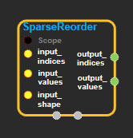
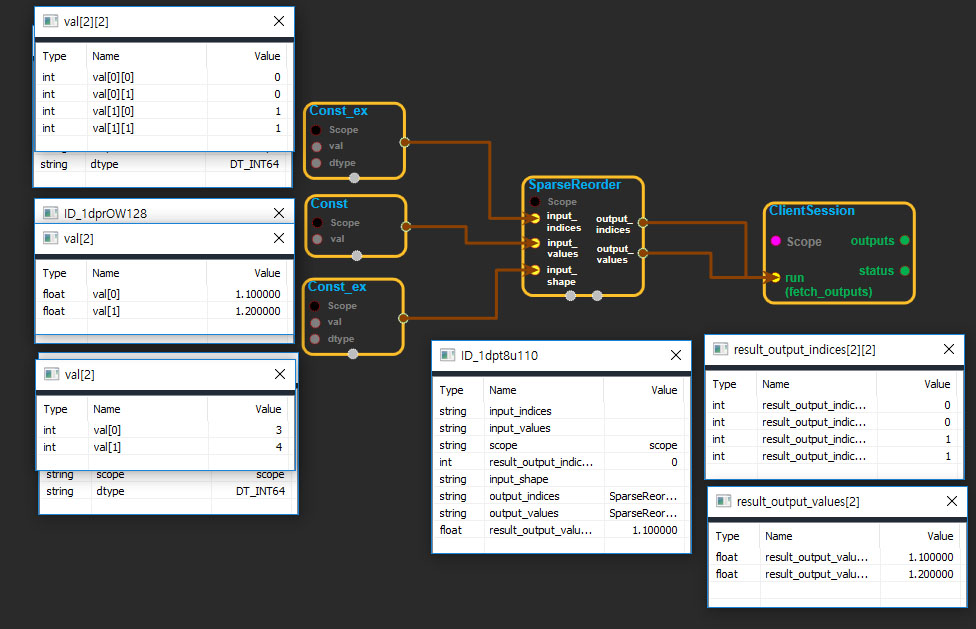

--- 
layout: default 
title: SparseReorder 
parent: sparse_ops 
grand_parent: enuSpace-Tensorflow API 
last_modified_date: now 
--- 

# SparseReorder

---

## tensorflow C++ API

[tensorflow::ops::SparseReorder](https://www.tensorflow.org/api_docs/cc/class/tensorflow/ops/sparse-reorder)

Reorders a SparseTensor into the canonical, row-major ordering.

---

## Summary

Note that by convention, all sparse ops preserve the canonical ordering along increasing dimension number. The only time ordering can be violated is during manual manipulation of the indices and values vectors to add entries.

Reordering does not affect the shape of the SparseTensor.

If the tensor has rank `R` and `N` non-empty values, `input_indices` has shape `[N, R]`, input\_values has length `N`, and input\_shape has length `R`.

Arguments:

* scope: A [Scope](https://www.tensorflow.org/api_docs/cc/class/tensorflow/scope.html#classtensorflow_1_1_scope) object
* input\_indices: 2-D. `N x R` matrix with the indices of non-empty values in a SparseTensor, possibly not in canonical ordering.
* input\_values: 1-D. `N` non-empty values corresponding to `input_indices`.
* input\_shape: 1-D. [Shape](https://www.tensorflow.org/api_docs/cc/class/tensorflow/ops/shape.html#classtensorflow_1_1ops_1_1_shape) of the input SparseTensor.

Returns:

* [`Output`](https://www.tensorflow.org/api_docs/cc/class/tensorflow/output.html#classtensorflow_1_1_output) output\_indices: 2-D. `N x R` matrix with the same indices as input\_indices, but in canonical row-major ordering.
* [`Output`](https://www.tensorflow.org/api_docs/cc/class/tensorflow/output.html#classtensorflow_1_1_output) output\_values: 1-D. `N` non-empty values corresponding to `output_indices`.

---

## SparseReorder block

Source link : [https://github.com/EXPNUNI/enuSpaceTensorflow/blob/master/enuSpaceTensorflow/tf\_sparse.cpp](https://github.com/EXPNUNI/enuSpaceTensorflow/blob/master/enuSpaceTensorflow/tf_sparse.cpp)

Argument:

* Scope scope : A Scope object \(A scope is generated automatically each page. A scope is not connected.\)
* Input sp\_indices: connect  Input node.
* Input sp\_values: connect  Input node.
* Input sp\_shape: connect  Input node.
* Input dense: connect  Input node.

Return:

* Output output: Output object of SparseDenseCwiseMul class object.

Result:

* std::vector\(Tensor\) product\_result : Returned object of executed result by calling session.

---

## Using Method

## 

