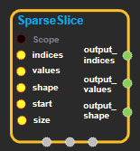
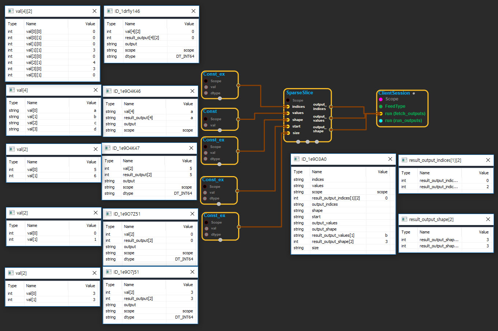

--- 
layout: default 
title: SparseSlice 
parent: sparse_ops 
grand_parent: enuSpace-Tensorflow API 
last_modified_date: now 
--- 

# SparseSlice

---

## tensorflow C++ API

[tensorflow::ops::SparseSlice](https://www.tensorflow.org/api_docs/cc/class/tensorflow/ops/sparse-slice)

[Slice](https://www.tensorflow.org/api_docs/cc/class/tensorflow/ops/slice.html#classtensorflow_1_1ops_1_1_slice) a`SparseTensor`based on the`start`and`size`.

---

## Summary

For example, if the input is

```
input_tensor = shape =[2,7]
[    a   d e  ]
[b c          ]
```

Graphically the output tensors are:

```
sparse_slice([0,0],[2,4])= shape =[2,4]
[    a  ]
[b c    ]

sparse_slice([0,4],[2,3])= shape =[2,3]
[ d e  ]
[      ]
```

Arguments:

* scope: A [Scope](https://www.tensorflow.org/api_docs/cc/class/tensorflow/scope.html#classtensorflow_1_1_scope) object
* indices: 2-D tensor represents the indices of the sparse tensor.
* values: 1-D tensor represents the values of the sparse tensor.
* shape: 1-D. tensor represents the shape of the sparse tensor.
* start: 1-D. tensor represents the start of the slice.
* size: 1-D. tensor represents the size of the slice. output indices: A list of 1-D tensors represents the indices of the output sparse tensors.

Returns:

* [`Output`](https://www.tensorflow.org/api_docs/cc/class/tensorflow/output.html#classtensorflow_1_1_output)output\_indices
* [`Output`](https://www.tensorflow.org/api_docs/cc/class/tensorflow/output.html#classtensorflow_1_1_output)output\_values: A list of 1-D tensors represents the values of the output sparse tensors.
* [`Output`](https://www.tensorflow.org/api_docs/cc/class/tensorflow/output.html#classtensorflow_1_1_output)output\_shape: A list of 1-D tensors represents the shape of the output sparse tensors.

---

## SparseSlice block

Source link : [https://github.com/EXPNUNI/enuSpaceTensorflow/blob/master/enuSpaceTensorflow/tf\_sparse.cpp](https://github.com/EXPNUNI/enuSpaceTensorflow/blob/master/enuSpaceTensorflow/tf_sparse.cpp)



Argument:

* Scope scope : A Scope object \(A scope is generated automatically each page. A scope is not connected.\)
* Input indices: connect  Input node.
* Input values: connect  Input node.
* Input shape: connect  Input node.
* Input start: connect  Input node.
* Input size: connect  Input node.

Return:

* Output output\_indices: Output object of SparseSlice class object.
* Output output\_values: Output object of SparseSlice class object.
* Output output\_shape: Output object of SparseSlice class object.

Result:

* std::vector\(Tensor\) result\_output\_indices : Returned object of executed result by calling session.
* std::vector\(Tensor\) result\_output\_values : Returned object of executed result by calling session.
* std::vector\(Tensor\) result\_output\_shape : Returned object of executed result by calling session.

---

## Using Method

## 


