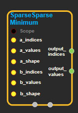
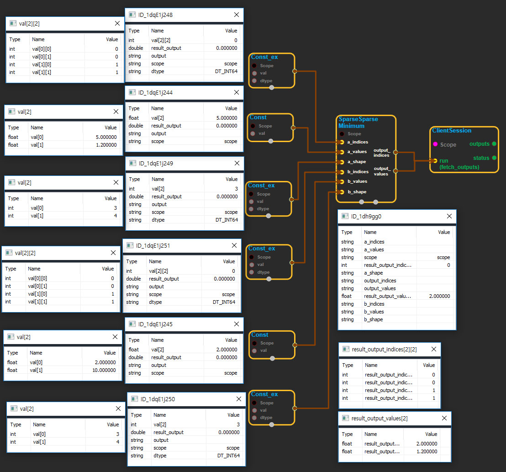

--- 
layout: default 
title: SparseSparseMinimum 
parent: sparse_ops 
grand_parent: enuSpace-Tensorflow API 
last_modified_date: now 
--- 

# SparseSparseMinimum

---

## tensorflow C++ API

[tensorflow::ops::SparseSparseMinimum](https://www.tensorflow.org/api_docs/cc/class/tensorflow/ops/sparse-sparse-minimum)

Returns the element-wise min of two SparseTensors.

---

## Summary

Assumes the two SparseTensors have the same shape, i.e., no broadcasting.

Arguments:

* scope: A [Scope](https://www.tensorflow.org/api_docs/cc/class/tensorflow/scope.html#classtensorflow_1_1_scope) object
* a\_indices: 2-D. `N x R` matrix with the indices of non-empty values in a SparseTensor, in the canonical lexicographic rdering.
* a\_values: 1-D. `N` non-empty values corresponding to `a_indices`.
* a\_shape: 1-D. [Shape](https://www.tensorflow.org/api_docs/cc/class/tensorflow/ops/shape.html#classtensorflow_1_1ops_1_1_shape) of the input SparseTensor.b\_indices: counterpart to `a_indices` for the other operand.
* b\_values: counterpart to `a_values` for the other operand; must be of the same dtype.
* b\_shape: counterpart to `a_shape` for the other operand; the two shapes must be equal.

Returns:

* [`Output`](https://www.tensorflow.org/api_docs/cc/class/tensorflow/output.html#classtensorflow_1_1_output) output\_indices: 2-D. The indices of the output SparseTensor.
* [`Output`](https://www.tensorflow.org/api_docs/cc/class/tensorflow/output.html#classtensorflow_1_1_output) output\_values: 1-D. The values of the output SparseTensor.

---

## SparseSparseMinimum block

Source link : [https://github.com/EXPNUNI/enuSpaceTensorflow/blob/master/enuSpaceTensorflow/tf\_sparse.cpp](https://github.com/EXPNUNI/enuSpaceTensorflow/blob/master/enuSpaceTensorflow/tf_sparse.cpp)

Argument:

* Scope scope : A Scope object \(A scope is generated automatically each page. A scope is not connected.\)
* Input a\_indices: connect  Input node.
* Input a\_values: connect  Input node.
* Input a\_shape: connect  Input node.
* Input b\_values: connect  Input node.
* Input b\_values: connect  Input node.
* Input b\_shape: connect  Input node.

Return:

* Output output\_indices: Output object of SparseSparseMaximum class object.
* Output output\_values: Output object of SparseSparseMaximum class object.

Result:

* std::vector\(Tensor\) result\_output\_indices : Returned object of executed result by calling session.
* std::vector\(Tensor\) result\_output\_values : Returned object of executed result by calling session.

---

## Using Method

## 

