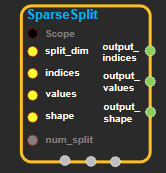
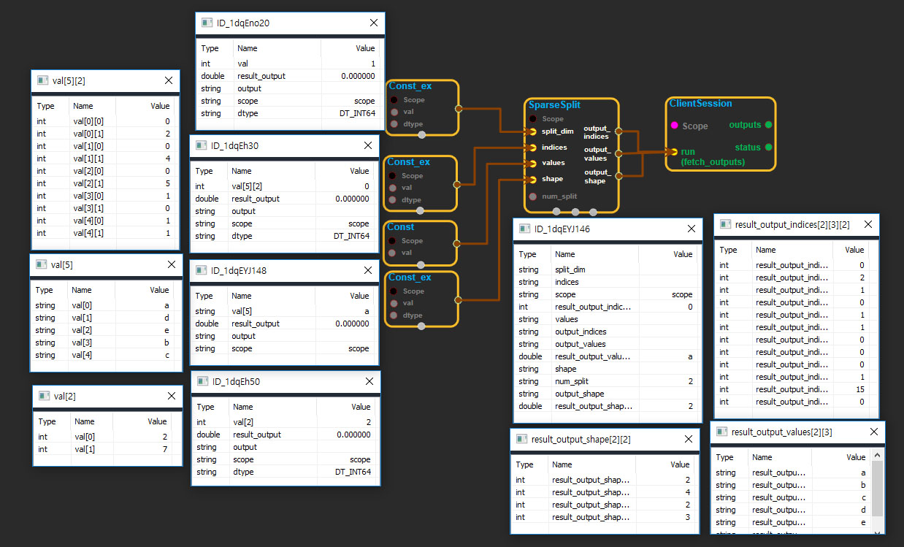

--- 
layout: default 
title: SparseSplit 
parent: sparse_ops 
grand_parent: enuSpace-Tensorflow API 
last_modified_date: now 
--- 

# SparseSplit

---

## tensorflow C++ API

[tensorflow::ops::SparseSplit](https://www.tensorflow.org/api_docs/cc/class/tensorflow/ops/sparse-split)

[Split](https://www.tensorflow.org/api_docs/cc/class/tensorflow/ops/split.html#classtensorflow_1_1ops_1_1_split) a `SparseTensor` into `num_split` tensors along one dimension.

---

## Summary

If the `shape[split_dim]` is not an integer multiple of `num_split`. Slices `[0 : shape[split_dim] % num_split]` gets one extra dimension. For example, if `split_dim = 1` and `num_split = 2` and the input is

```
input_tensor = shape =[2,7]
[    a   d e  ]
[b c          ]
```

Graphically the output tensors are:

```
output_tensor[0]= shape =[2,4]
[    a  ]
[b c    ]

output_tensor[1]= shape=[2,3]
[d e  ]
[     ]
```

Arguments:

* scope: A [Scope](https://www.tensorflow.org/api_docs/cc/class/tensorflow/scope.html#classtensorflow_1_1_scope) object
* split\_dim: 0-D. The dimension along which to split. Must be in the range `[0, rank(shape))`.
* indices: 2-D tensor represents the indices of the sparse tensor.
* values: 1-D tensor represents the values of the sparse tensor.
* shape: 1-D. tensor represents the shape of the sparse tensor. output indices: A list of 1-D tensors represents the indices of the output sparse tensors.
* num\_split: The number of ways to split.

Returns:

* `OutputList` output\_indices
* `OutputList` output\_values: A list of 1-D tensors represents the values of the output sparse tensors.
* `OutputList` output\_shape: A list of 1-D tensors represents the shape of the output sparse tensors.

---

## SparseSplit block

Source link : [https://github.com/EXPNUNI/enuSpaceTensorflow/blob/master/enuSpaceTensorflow/tf\_sparse.cpp](https://github.com/EXPNUNI/enuSpaceTensorflow/blob/master/enuSpaceTensorflow/tf_sparse.cpp)



Argument:

* Scope scope : A Scope object \(A scope is generated automatically each page. A scope is not connected.\)
* Input split\_dim : connect  Input node.
* Input indices: connect  Input node.
* Input values: connect  Input node.
* Input shape: connect  Input node.
* int64 num\_split: input int64 in value.

Return:

* OutputList  output\_indices: Output object of SparseSplit class object.
* OutputList  output\_values: Output object of SparseSplit class object.
* OutputList  output\_shape: Output object of SparseSplit class object.

Result:

* std::vector\(Tensor\) output\_indices\_result : Returned object of executed result by calling session.
* std::vector\(Tensor\) output\_values\_result : Returned object of executed result by calling session.
* std::vector\(Tensor\) output\_shape\_result : Returned object of executed result by calling session.

---

## Using Method

## 


