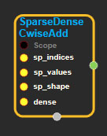

--- 
layout: default 
title: SparseDenseCwiseAdd 
parent: sparse_ops 
grand_parent: enuSpace-Tensorflow API 
last_modified_date: now 
--- 

# SparseDenseCwiseAdd

---

## tensorflow C++ API

[tensorflow::ops::SparseDenseCwiseAdd](https://www.tensorflow.org/api_docs/cc/class/tensorflow/ops/sparse-dense-cwise-add)

Adds up a SparseTensor and a dense [Tensor](https://www.tensorflow.org/api_docs/cc/class/tensorflow/tensor.html#classtensorflow_1_1_tensor), using these special rules:

---

## Summary

\(1\) Broadcasts the dense side to have the same shape as the sparse side, if eligible; \(2\) Then, only the dense values pointed to by the indices of the SparseTensor participate in the cwise addition.

By these rules, the result is a logical SparseTensor with exactly the same indices and shape, but possibly with different non-zero values. The output of this Op is the resultant non-zero values.

Arguments:

* scope: A [Scope](https://www.tensorflow.org/api_docs/cc/class/tensorflow/scope.html#classtensorflow_1_1_scope) object
* sp\_indices: 2-D. `N x R` matrix with the indices of non-empty values in a SparseTensor, possibly not in canonical ordering.
* sp\_values: 1-D. `N` non-empty values corresponding to `sp_indices`.
* sp\_shape: 1-D. [Shape](https://www.tensorflow.org/api_docs/cc/class/tensorflow/ops/shape.html#classtensorflow_1_1ops_1_1_shape) of the input SparseTensor.
* dense: `R`-D. The dense [Tensor](https://www.tensorflow.org/api_docs/cc/class/tensorflow/tensor.html#classtensorflow_1_1_tensor) operand.

Returns:

* [`Output`](https://www.tensorflow.org/api_docs/cc/class/tensorflow/output.html#classtensorflow_1_1_output): 1-D. The `N` values that are operated on.

---

## SparseDenseCwiseAdd block

Source link : [https://github.com/EXPNUNI/enuSpaceTensorflow/blob/master/enuSpaceTensorflow/tf\_sparse.cpp](https://github.com/EXPNUNI/enuSpaceTensorflow/blob/master/enuSpaceTensorflow/tf_sparse.cpp)

Argument:

* Scope scope : A Scope object \(A scope is generated automatically each page. A scope is not connected.\)
* Input sp\_indices: connect  Input node.
* Input sp\_values: connect  Input node.
* Input sp\_shape: connect  Input node.
* Input dense: connect  Input node.

Return:

* Output output: Output object of SparseDenseCwiseAdd class object.

Result:

* std::vector\(Tensor\) product\_result : Returned object of executed result by calling session.

---

## Using Method

