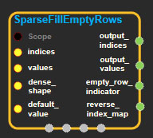
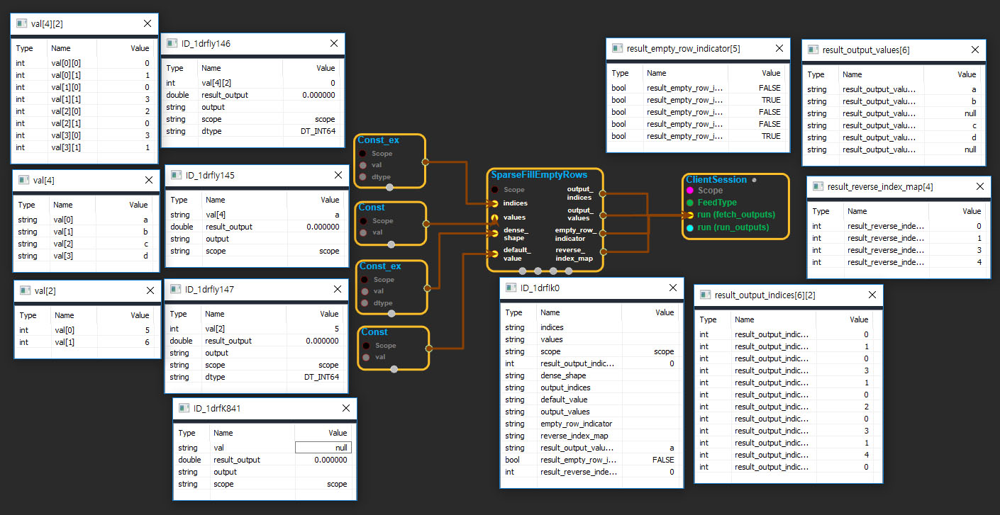

--- 
layout: default 
title: SparseFillEmptyRows 
parent: sparse_ops 
grand_parent: enuSpace-Tensorflow API 
last_modified_date: now 
--- 

# SparseFillEmptyRows

---

## tensorflow C++ API

[tensorflow::ops::SparseFillEmptyRows](https://www.tensorflow.org/api_docs/cc/class/tensorflow/ops/sparse-fill-empty-rows)

Fills empty rows in the input 2-D`SparseTensor`with a default value.

---

## Summary

The input`SparseTensor`is represented via the tuple of inputs \(`indices`,`values`,`dense_shape`\). The output`SparseTensor`has the same`dense_shape`but with indices`output_indices`and values`output_values`.

This op inserts a single entry for every row that doesn't have any values. The index is created as`[row, 0, ..., 0]`and the inserted value is`default_value`.

For example, suppose`sp_input`has shape`[5, 6]`and non-empty values:

```

```

Rows 1 and 4 are empty, so the output will be of shape`[5, 6]`with values:

```

```

The output`SparseTensor`will be in row-major order and will have the same shape as the input.

This op also returns an indicator vector shaped`[dense_shape[0]]`such that

```
empty_row_indicator[i]=True iff row i was an empty row.
```

And a reverse index map vector shaped`[indices.shape[0]]`that is used during backpropagation,

```
reverse_index_map[j]= out_j s.t. indices[j,:]== output_indices[out_j,:]
```

Arguments:

* scope: A [Scope](https://www.tensorflow.org/api_docs/cc/class/tensorflow/scope.html#classtensorflow_1_1_scope) object
* indices: 2-D. the indices of the sparse tensor.
* values: 1-D. the values of the sparse tensor.
* dense\_shape: 1-D. the shape of the sparse tensor.
* default\_value: 0-D. default value to insert into location`[row, 0, ..., 0]`
  for rows missing from the input sparse tensor. output indices: 2-D. the indices of the filled sparse tensor.

Returns:

* [`Output`](https://www.tensorflow.org/api_docs/cc/class/tensorflow/output.html#classtensorflow_1_1_output)output\_indices
* [`Output`](https://www.tensorflow.org/api_docs/cc/class/tensorflow/output.html#classtensorflow_1_1_output)output\_values: 1-D. the values of the filled sparse tensor.
* [`Output`](https://www.tensorflow.org/api_docs/cc/class/tensorflow/output.html#classtensorflow_1_1_output)empty\_row\_indicator: 1-D. whether the dense row was missing in the input sparse tensor.
* [`Output`](https://www.tensorflow.org/api_docs/cc/class/tensorflow/output.html#classtensorflow_1_1_output)reverse\_index\_map: 1-D. a map from the input indices to the output indices.

---

## SparseFillEmptyRows block

Source link : [https://github.com/EXPNUNI/enuSpaceTensorflow/blob/master/enuSpaceTensorflow/tf\_sparse.cpp](https://github.com/EXPNUNI/enuSpaceTensorflow/blob/master/enuSpaceTensorflow/tf_sparse.cpp)



Argument:

* Scope scope : A Scope object \(A scope is generated automatically each page. A scope is not connected.\)
* Input indices: connect  Input node.
* Input values: connect  Input node.
* Input dense\_shape: connect  Input node.
* Input default\_value: connect  Input node.

Return:

* Output output\_indices: Output object of SparseFillEmptyRows class object.
* Output output\_values: Output object of SparseFillEmptyRows class object.
* Output empty\_row\_indicator: Output object of SparseFillEmptyRows class object.
* Output reverse\_index\_map: Output object of SparseFillEmptyRows class object.

Result:

* std::vector\(Tensor\) result\_output\_indices : Returned object of executed result by calling session.
* std::vector\(Tensor\) result\_output\_values : Returned object of executed result by calling session.
* std::vector\(Tensor\) result\_empty\_row\_indicator : Returned object of executed result by calling session.
* std::vector\(Tensor\) result\_reverse\_index\_map : Returned object of executed result by calling session.

---

## Using Method



