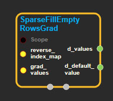
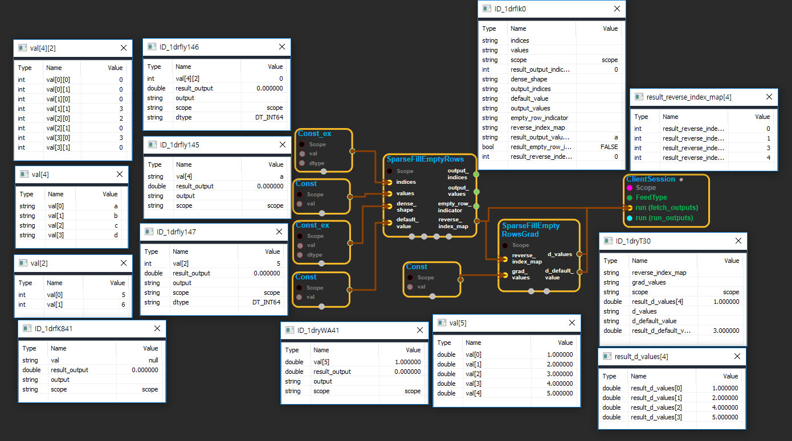

--- 
layout: default 
title: SparseFillEmptyRowsGrad 
parent: sparse_ops 
grand_parent: enuSpace-Tensorflow API 
last_modified_date: now 
--- 

# SparseFillEmptyRowsGrad

---

## tensorflow C++ API

[tensorflow::ops::SparseFillEmptyRowsGrad](https://www.tensorflow.org/api_docs/cc/class/tensorflow/ops/sparse-fill-empty-rows-grad)

The gradient of [SparseFillEmptyRows](https://www.tensorflow.org/api_docs/cc/class/tensorflow/ops/sparse-fill-empty-rows.html#classtensorflow_1_1ops_1_1_sparse_fill_empty_rows).

---

## Summary

Takes vectors reverse\_index\_map, shaped`[N]`, and grad\_values, shaped`[N_full]`, where`N_full >= N`and copies data into either`d_values`or`d_default_value`. Here`d_values`is shaped`[N]`and`d_default_value`is a scalar.

d\_values\[j\] = grad\_values\[reverse\_index\_map\[j\]\] d\_default\_value = sum\_{k : 0 .. N\_full - 1} \( grad\_values\[k\] \* 1{k not in reverse\_index\_map}\)

Arguments:

* scope: A [Scope](https://www.tensorflow.org/api_docs/cc/class/tensorflow/scope.html#classtensorflow_1_1_scope) object
* reverse\_index\_map: 1-D. The reverse index map from [SparseFillEmptyRows](https://www.tensorflow.org/api_docs/cc/class/tensorflow/ops/sparse-fill-empty-rows.html#classtensorflow_1_1ops_1_1_sparse_fill_empty_rows).
* grad\_values: 1-D. The gradients from backprop.

Returns:

* [`Output`](https://www.tensorflow.org/api_docs/cc/class/tensorflow/output.html#classtensorflow_1_1_output) d\_values: 1-D. The backprop into values.
* [`Output`](https://www.tensorflow.org/api_docs/cc/class/tensorflow/output.html#classtensorflow_1_1_output) d\_default\_value: 0-D. The backprop into default\_value.

---

## SparseFillEmptyRowsGrad block

Source link : [https://github.com/EXPNUNI/enuSpaceTensorflow/blob/master/enuSpaceTensorflow/tf\_sparse.cpp](https://github.com/EXPNUNI/enuSpaceTensorflow/blob/master/enuSpaceTensorflow/tf_sparse.cpp)

Argument:

* Scope scope : A Scope object \(A scope is generated automatically each page. A scope is not connected.\)
* Input reverse\_index\_map: connect  Input node.
* Input grad\_values: connect  Input node.

Return:

* Output d\_values: Output object of SparseFillEmptyRowsGrad class object.
* Output d\_default\_value: Output object of SparseFillEmptyRowsGrad class object.

Result:

* std::vector\(Tensor\) result\_d\_values : Returned object of executed result by calling session.
* std::vector\(Tensor\) result\_d\_default\_value : Returned object of executed result by calling session.

---

## Using Method

