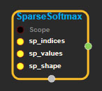
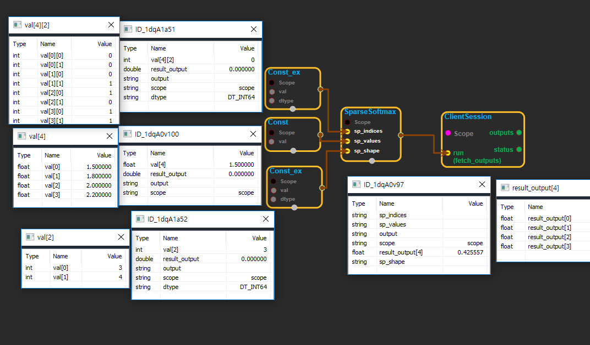

--- 
layout: default 
title: SparseSoftmax 
parent: sparse_ops 
grand_parent: enuSpace-Tensorflow API 
last_modified_date: now 
--- 

# SparseSoftmax

---

## tensorflow C++ API

[tensorflow::ops::](https://www.tensorflow.org/api_docs/cc/class/tensorflow/ops/sparse-reshape)SparseSoftmax

Applies softmax to a batched N-D `SparseTensor`.

---

## Summary

The inputs represent an N-D SparseTensor with logical shape `[..., B, C]` \(where `N >= 2`\), and with indices sorted in the canonical lexicographic order.

This op is equivalent to applying the normal `tf.nn.softmax()` to each innermost logical submatrix with shape `[B, C]`, but with the catch that the implicitly zero elements do not participate. Specifically, the algorithm is equivalent to the following:

\(1\) Applies `tf.nn.softmax()` to a densified view of each innermost submatrix with shape `[B, C]`, along the size-C dimension; \(2\) Masks out the original implicitly-zero locations; \(3\) Renormalizes the remaining elements.

Hence, the `SparseTensor` result has exactly the same non-zero indices and shape.

Arguments:

* scope: A [Scope](https://www.tensorflow.org/api_docs/cc/class/tensorflow/scope.html#classtensorflow_1_1_scope) object
* sp\_indices: 2-D. `NNZ x R` matrix with the indices of non-empty values in a SparseTensor, in canonical ordering.
* sp\_values: 1-D. `NNZ` non-empty values corresponding to`sp_indices`.
* sp\_shape: 1-D. [Shape](https://www.tensorflow.org/api_docs/cc/class/tensorflow/ops/shape.html#classtensorflow_1_1ops_1_1_shape) of the input SparseTensor.

Returns:

* [`Output`](https://www.tensorflow.org/api_docs/cc/class/tensorflow/output.html#classtensorflow_1_1_output): 1-D. The `NNZ` values for the result `SparseTensor`
  .

---

## SparseSoftmax block

Source link : [https://github.com/EXPNUNI/enuSpaceTensorflow/blob/master/enuSpaceTensorflow/tf\_sparse.cpp](https://github.com/EXPNUNI/enuSpaceTensorflow/blob/master/enuSpaceTensorflow/tf_sparse.cpp)

Argument:

* Scope scope : A Scope object \(A scope is generated automatically each page. A scope is not connected.\)
* Input sp\_indices: connect  Input node.
* Input sp\_values: connect  Input node.
* Input sp\_shape: connect  Input node.

Return:

* Output output: Output object of SparseSoftmax class object.

Result:

* std::vector\(Tensor\) product\_result : Returned object of executed result by calling session.

---

## Using Method

## 

