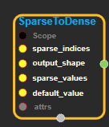
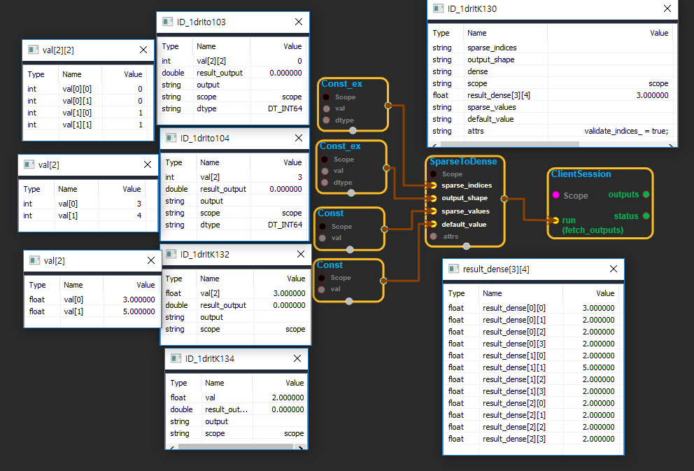

--- 
layout: default 
title: SparseToDense 
parent: sparse_ops 
grand_parent: enuSpace-Tensorflow API 
last_modified_date: now 
--- 

# SparseToDense

---

## tensorflow C++ API

[tensorflow::ops::SparseToDense](https://www.tensorflow.org/api_docs/cc/class/tensorflow/ops/sparse-to-dense)

Converts a sparse representation into a dense tensor.

---

## Summary

Builds an array`dense`with shape`output_shape`such that

\`\`\` If sparse\_indices is scalar

dense\[i\] = \(i == sparse\_indices ? sparse\_values : default\_value\)

If sparse\_indices is a vector, then for each i

dense\[sparse\_indices\[i\]\] = sparse\_values\[i\]

If sparse\_indices is an n by d matrix, then for each i in \[0, n\)

dense\[sparse\_indices\[i\]\[0\], ..., sparse\_indices\[i\]\[d-1\]\] = sparse\_values\[i\] \`\`\`

[All](https://www.tensorflow.org/api_docs/cc/class/tensorflow/ops/all.html#classtensorflow_1_1ops_1_1_all)other values in`dense`are set to`default_value`. If`sparse_values`is a scalar, all sparse indices are set to this single value.

Indices should be sorted in lexicographic order, and indices must not contain any repeats. If`validate_indices`is true, these properties are checked during execution.

Arguments:

* scope: A[Scope](https://www.tensorflow.org/api_docs/cc/class/tensorflow/scope.html#classtensorflow_1_1_scope) object
* sparse\_indices: 0-D, 1-D, or 2-D.`sparse_indices[i]`contains the complete index where`sparse_values[i]`will be placed.
* output\_shape: 1-D.[Shape](https://www.tensorflow.org/api_docs/cc/class/tensorflow/ops/shape.html#classtensorflow_1_1ops_1_1_shape)of the dense output tensor.
* sparse\_values: 1-D. Values corresponding to each row of`sparse_indices`, or a scalar value to be used for all sparse indices.
* default\_value: Scalar value to set for indices not specified in`sparse_indices`.

Optional attributes \(see[`Attrs`](https://www.tensorflow.org/api_docs/cc/struct/tensorflow/ops/sparse-to-dense/attrs.html#structtensorflow_1_1ops_1_1_sparse_to_dense_1_1_attrs)\):

* validate\_indices: If true, indices are checked to make sure they are sorted in lexicographic order and that there are no repeats.

Returns:

* [`Output`](https://www.tensorflow.org/api_docs/cc/class/tensorflow/output.html#classtensorflow_1_1_output): Dense output tensor of shape`output_shape`
  .

---

## SparseToDense block

Source link : [https://github.com/EXPNUNI/enuSpaceTensorflow/blob/master/enuSpaceTensorflow/tf\_sparse.cpp](https://github.com/EXPNUNI/enuSpaceTensorflow/blob/master/enuSpaceTensorflow/tf_sparse.cpp)

Argument:

* Scope scope : A Scope object \(A scope is generated automatically each page. A scope is not connected.\)
* Input sparse\_indices: connect  Input node.
* Input output\_shape: connect  Input node.
* Input sparse\_values: connect  Input node.
* Input default\_value: connect  Input node.
* SparseToDense::Attrs attrs : Input attrs in value. ex\) validate\_indices\_ = true;

Return:

* Output  output: Output object of SparseToDense class object.

Result:

* std::vector\(Tensor\) _result_\_output : Returned object of executed result by calling session.

---

## Using Method

## 

