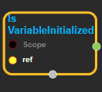
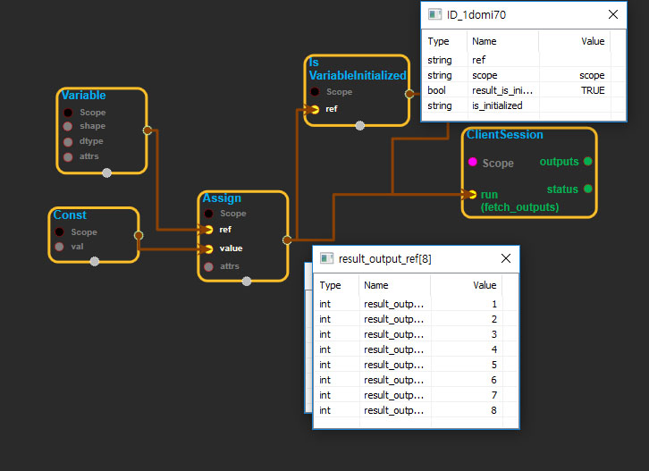
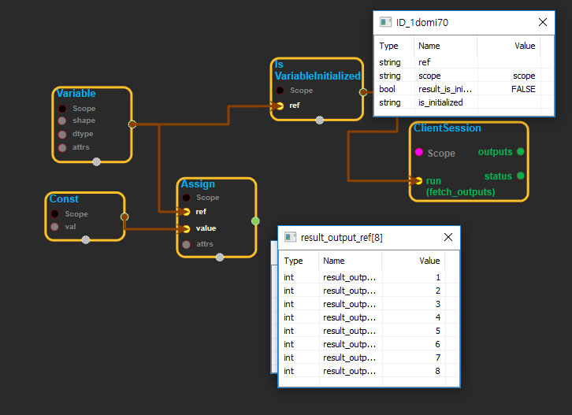

--- 
layout: default 
title: IsVariableInitialized 
parent: state_ops 
grand_parent: enuSpace-Tensorflow API 
last_modified_date: now 
--- 

# IsVariableInitialized

---

## tensorflow C++ API

[tensorflow::ops::IsVariableInitialized](https://www.tensorflow.org/api_docs/cc/class/tensorflow/ops/is-variable-initialized)

Checks whether a tensor has been initialized.

---

## Summary

Outputs boolean scalar indicating whether the tensor has been initialized.

Arguments:

* scope: A [Scope](https://www.tensorflow.org/api_docs/cc/class/tensorflow/scope.html#classtensorflow_1_1_scope) object
* ref: Should be from a [`Variable`](https://www.tensorflow.org/api_docs/cc/class/tensorflow/ops/variable.html#classtensorflow_1_1ops_1_1_variable) node. May be uninitialized.

Returns:

* [`Output`](https://www.tensorflow.org/api_docs/cc/class/tensorflow/output.html#classtensorflow_1_1_output): The is\_initialized tensor.

---

## IsVariableInitialized block

Source link : [https://github.com/EXPNUNI/enuSpaceTensorflow/blob/master/enuSpaceTensorflow/tf\_state.cpp](https://github.com/EXPNUNI/enuSpaceTensorflow/blob/master/enuSpaceTensorflow/tf_state.cpp)

Argument:

* Scope scope : A Scope object \(A scope is generated automatically each page. A scope is not connected.\)
* Input ref: connect  Input node.

Return:

* Output output : Output object of IsVariableInitialized class object.

Result:

* std::vector\(Tensor\) product\_result : Returned object of executed result by calling session.

---

## Using Method

