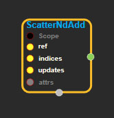
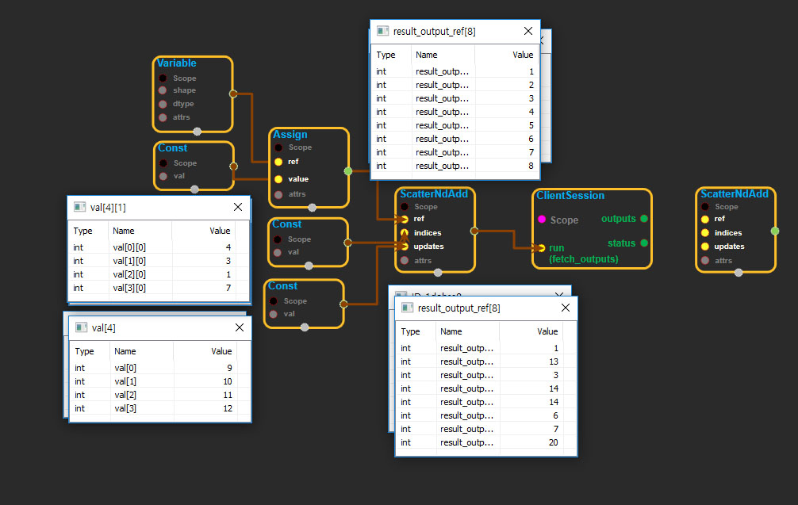

--- 
layout: default 
title: ScatterNdAdd 
parent: state_ops 
grand_parent: enuSpace-Tensorflow API 
last_modified_date: now 
--- 

# ScatterNdAdd

---

## tensorflow C++ API

[tensorflow::ops::ScatterNdAdd](https://www.tensorflow.org/api_docs/cc/class/tensorflow/ops/scatter-nd-add)

Applies sparse addition between `updates` and individual values or slices.

---

## Summary

within a given variable according to `indices`.

`ref` is a [`Tensor`](https://www.tensorflow.org/api_docs/cc/class/tensorflow/tensor.html#classtensorflow_1_1_tensor) with rank `P` and `indices` is a [`Tensor`](https://www.tensorflow.org/api_docs/cc/class/tensorflow/tensor.html#classtensorflow_1_1_tensor) of rank `Q`.

`indices` must be integer tensor, containing indices into `ref`. It must be shape `[d_0, ..., d_{Q-2}, K]` where `0 < K <= P`.

The innermost dimension of `indices` \(with length `K`\) corresponds to indices into elements \(if `K = P`\) or slices \(if `K < P`\) along the `K`th dimension of `ref`.

`updates` is [`Tensor`](https://www.tensorflow.org/api_docs/cc/class/tensorflow/tensor.html#classtensorflow_1_1_tensor) of rank `Q-1+P-K` with shape:

\`\`\` \[d\_0, ..., d\_{Q-2}, ref.shape\[K\], ..., ref.shape\[P-1\]\]. \`\`\`

For example, say we want to add 4 scattered elements to a rank-1 tensor to 8 elements. In Python, that addition would look like this:

```
ref = tf.Variable([1, 2, 3, 4, 5, 6, 7, 8])
indices = tf.constant([[4], [3], [1], [7]])
updates = tf.constant([9, 10, 11, 12])
add = tf.scatter_nd_add(ref, indices, updates)
with tf.Session() as sess:
  print sess.run(add)
```

The resulting update to ref would look like this:

```
[1,13,3,14,14,6,7,20]
```

See tf.scatter\_nd for more details about how to make updates to slices.

Arguments:

* scope: A [Scope](https://www.tensorflow.org/api_docs/cc/class/tensorflow/scope.html#classtensorflow_1_1_scope) object
* ref: A mutable [Tensor](https://www.tensorflow.org/api_docs/cc/class/tensorflow/tensor.html#classtensorflow_1_1_tensor). Should be from a [Variable](https://www.tensorflow.org/api_docs/cc/class/tensorflow/ops/variable.html#classtensorflow_1_1ops_1_1_variable) node.
* indices: A [Tensor](https://www.tensorflow.org/api_docs/cc/class/tensorflow/tensor.html#classtensorflow_1_1_tensor). Must be one of the following types: int32, int64. A tensor of indices into ref.
* updates: A [Tensor](https://www.tensorflow.org/api_docs/cc/class/tensorflow/tensor.html#classtensorflow_1_1_tensor). Must have the same type as ref. A tensor of updated values to add to ref.

Optional attributes \(see [`Attrs`](https://www.tensorflow.org/api_docs/cc/struct/tensorflow/ops/scatter-nd-add/attrs.html#structtensorflow_1_1ops_1_1_scatter_nd_add_1_1_attrs)\):

* use\_locking: An optional bool. Defaults to True. If True, the assignment will be protected by a lock; otherwise the behavior is undefined, but may exhibit less contention.

Returns:

* [`Output`](https://www.tensorflow.org/api_docs/cc/class/tensorflow/output.html#classtensorflow_1_1_output): Same as ref. Returned as a convenience for operations that want to use the updated values after the update is done.

---

## ScatterNdAdd block

Source link : [https://github.com/EXPNUNI/enuSpaceTensorflow/blob/master/enuSpaceTensorflow/tf\_state.cpp](https://github.com/EXPNUNI/enuSpaceTensorflow/blob/master/enuSpaceTensorflow/tf_state.cpp)



Argument:

* Scope scope : A Scope object \(A scope is generated automatically each page. A scope is not connected.\)
* Input ref: connect  Input node.
* Input indices: connect Input node.
* Input updates: connect Input node.
* ScatterNdAdd ::Attrs attrs : Input attrs in value. ex\)use\_locking\_ = true;

Return:

* Output output : Output object of ScatterNdAdd class object.

Result:

* std::vector\(Tensor\) product\_result : Returned object of executed result by calling session.

---

## Using Method

## 

\*Assign에 연결된 ClientSession은 Assign값을 확인하기 위해 작성된 temp입니다. ClientSession은 처리순서가 있으므로 테스트시 생성을 마지막에 작성하여 사용합니다

