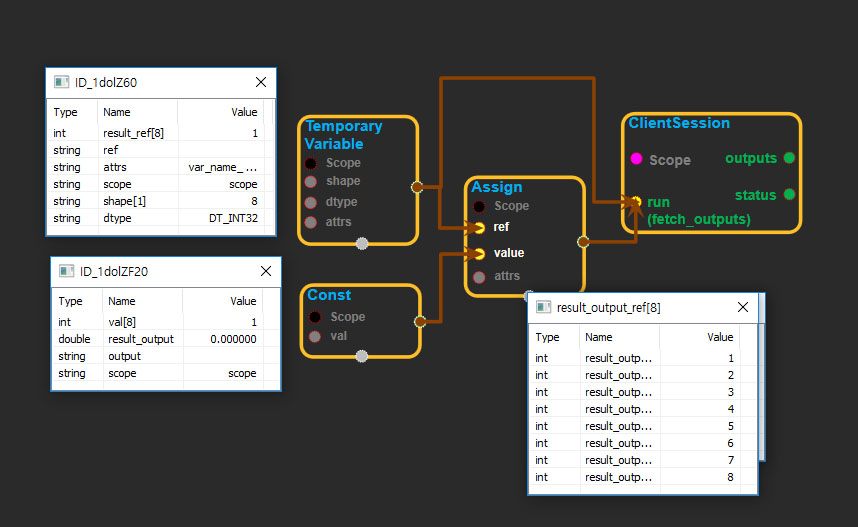

--- 
layout: default 
title: TemporaryVariable 
parent: state_ops 
grand_parent: enuSpace-Tensorflow API 
last_modified_date: now 
--- 

# TemporaryVariable

---

## tensorflow C++ API

[tensorflow::ops::TemporaryVariable](https://www.tensorflow.org/api_docs/cc/class/tensorflow/ops/temporary-variable)

Returns a tensor that may be mutated, but only persists within a single step.

---

## Summary

This is an experimental op for internal use only and it is possible to use this op in unsafe ways. DO NOT USE unless you fully understand the risks.

It is the caller's responsibility to ensure that 'ref' is eventually passed to a matching '[DestroyTemporaryVariable](https://www.tensorflow.org/api_docs/cc/class/tensorflow/ops/destroy-temporary-variable.html#classtensorflow_1_1ops_1_1_destroy_temporary_variable)' op after all other uses have completed.

Outputs a ref to the tensor state so it may be read or modified.

E.g. var = state\_ops.\_temporary\_variable\(\[1, 2\], types.float\_\) var\_name = var.op.name var = state\_ops.assign\(var, \[\[4.0, 5.0\]\]\) var = state\_ops.assign\_add\(var, \[\[6.0, 7.0\]\]\) final = state\_ops.\_destroy\_temporary\_variable\(var, var\_name=var\_name\)

Arguments:

* scope: A [Scope](https://www.tensorflow.org/api_docs/cc/class/tensorflow/scope.html#classtensorflow_1_1_scope) object
* shape: The shape of the variable tensor.
* dtype: The type of elements in the variable tensor.

Optional attributes \(see [`Attrs`](https://www.tensorflow.org/api_docs/cc/struct/tensorflow/ops/temporary-variable/attrs.html#structtensorflow_1_1ops_1_1_temporary_variable_1_1_attrs)\):

* var\_name: Overrides the name used for the temporary variable resource. Default value is the name of the '
  [TemporaryVariable](https://www.tensorflow.org/api_docs/cc/class/tensorflow/ops/temporary-variable.html#classtensorflow_1_1ops_1_1_temporary_variable)
  ' op \(which is guaranteed unique\).

Returns:

* [`Output`](https://www.tensorflow.org/api_docs/cc/class/tensorflow/output.html#classtensorflow_1_1_output): A reference to the variable tensor.

---

## TemporaryVariable block

Source link : [https://github.com/EXPNUNI/enuSpaceTensorflow/blob/master/enuSpaceTensorflow/tf\_state.cpp](https://github.com/EXPNUNI/enuSpaceTensorflow/blob/master/enuSpaceTensorflow/tf_state.cpp)

Argument:

* Scope scope : A Scope object \(A scope is generated automatically each page. A scope is not connected.\)
* `PartialTensorShape`shape: Input shape in value. ex\)shape\[1\] =&gt;8
* `DataType`dtype: input dtype in value. ex\)DT\_INT32;
* TemporaryVariable ::Attrs attrs : Input attrs in value. ex\)var\_name\_ =AB;

Return:

* Output output : Output object of TemporaryVariable  class object.

Result:

* std::vector\(Tensor\) product\_result : Returned object of executed result by calling session.

---

## Using Method

