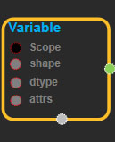
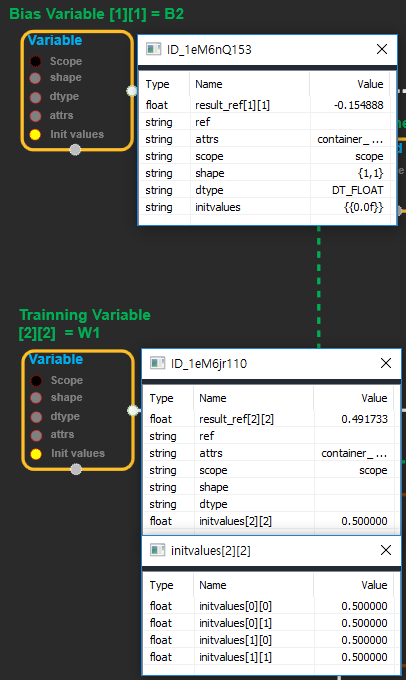
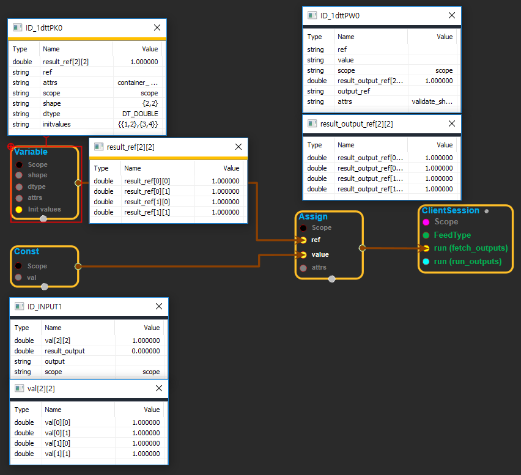
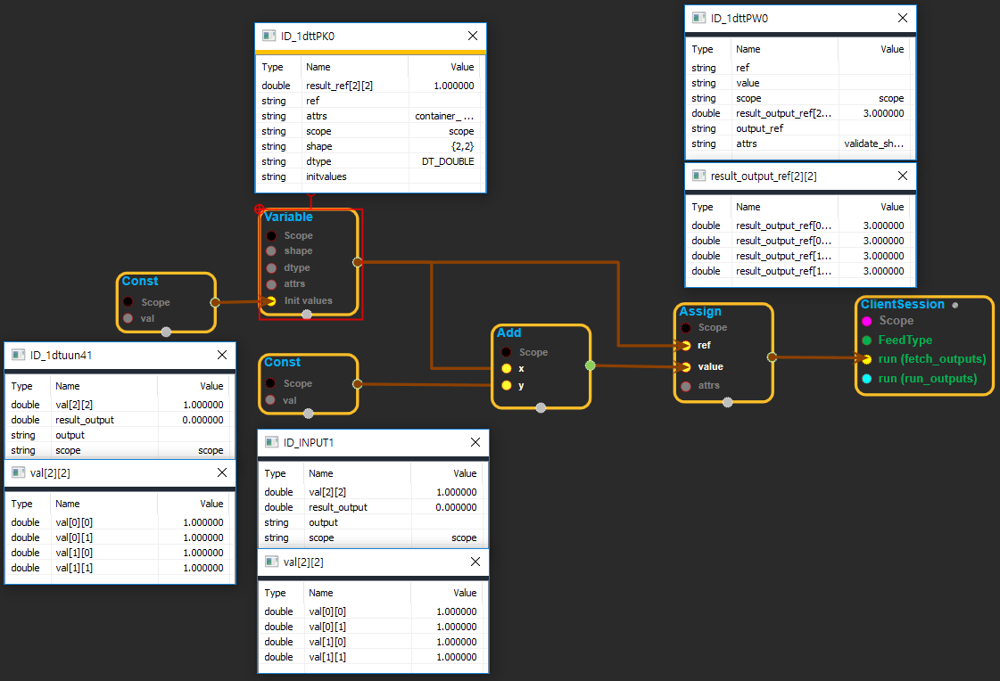
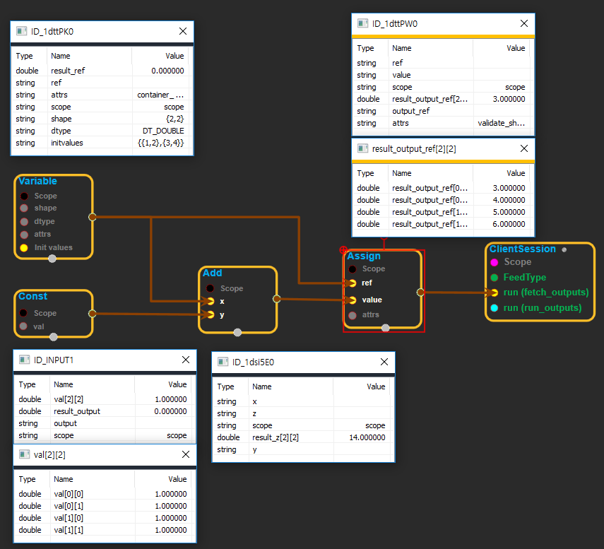

--- 
layout: default 
title: Variable 
parent: state_ops 
grand_parent: enuSpace-Tensorflow API 
last_modified_date: now 
--- 

# Variable

---

## tensorflow C++ API

[tensorflow::ops::Variable](https://www.tensorflow.org/api_docs/cc/class/tensorflow/ops/variable)

Holds state in the form of a tensor that persists across steps.

---

## Summary

Outputs a ref to the tensor state so it may be read or modified. TODO\(zhifengc/mrry\): Adds a pointer to a more detail document about sharing states in tensorflow.

Arguments:

* scope: A [Scope](https://www.tensorflow.org/api_docs/cc/class/tensorflow/scope.html#classtensorflow_1_1_scope) object
* shape: The shape of the variable tensor.
* dtype: The type of elements in the variable tensor.

Optional attributes \(see [`Attrs`](https://www.tensorflow.org/api_docs/cc/struct/tensorflow/ops/variable/attrs.html#structtensorflow_1_1ops_1_1_variable_1_1_attrs)\):

* container: If non-empty, this variable is placed in the given container. Otherwise, a default container is used.
* shared\_name: If non-empty, this variable is named in the given bucket with this shared\_name. Otherwise, the node name is used instead.

Returns:

* [`Output`](https://www.tensorflow.org/api_docs/cc/class/tensorflow/output.html#classtensorflow_1_1_output): A reference to the variable tensor.

---

## Variable block

Source link : [https://github.com/EXPNUNI/enuSpaceTensorflow/blob/master/enuSpaceTensorflow/tf\_state.cpp](https://github.com/EXPNUNI/enuSpaceTensorflow/blob/master/enuSpaceTensorflow/tf_state.cpp)

Argument:

* Scope scope : A Scope object \(A scope is generated automatically each page. A scope is not connected.\)
* `PartialTensorShape`shape: Input shape in value. ex\)shape\[1\] =&gt;8
* `DataType`dtype: input dtype in value. ex\)DT\_INT32;
* Variable::Attrs attrs : Input attrs in value. ex\)var\_name\_ =AB;

Return:

* Output output : Output object of Variable class object.

Result:

* std::vector\(Tensor\) product\_result : Returned object of executed result by calling session.

---

## Using Method

Variable 객체 설정 방법

1. dtype의 값을 입력 dtype = DT\_FLOAT, shape = \{1,1\}, initvalues = \{\{0.0f\}\}를 입력하여 생성
2. initvalues의 modify shape 수행, 변수 타입설정 "int, bool, float, double, string" 개별 배열의 값 설정 \(주. shape, dtype의 값은 어떠한 문자열도 입력하지 않아야 함\)

Variable 객체는 Assign과 함께 사용하여 동작을 수행함.

Variable 객체의 초기화는 상수객체를 연결하거나 initvalues의 입력으로 설정을 수행.

Output 객체 Add를 활용한 Feedback 샘플

