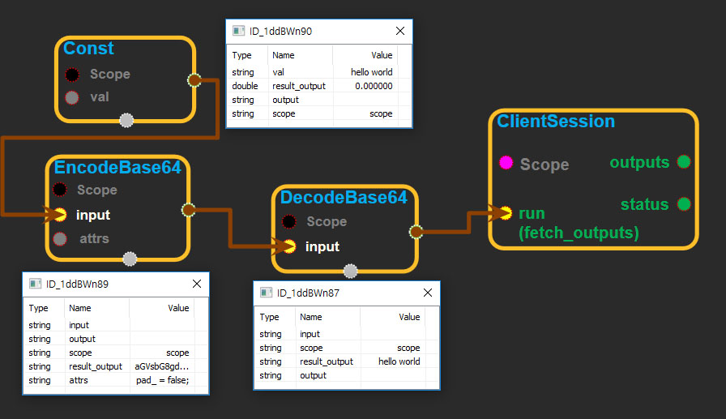

--- 
layout: default 
title: DecodeBase64 
parent: string_ops 
grand_parent: enuSpace-Tensorflow API 
last_modified_date: now 
--- 

# DecodeBase64

---

## tensorflow C++ API

[tensorflow::ops::DecodeBase64](https://www.tensorflow.org/api_docs/cc/class/tensorflow/ops/decode-base64)

Decode web-safe base64-encoded strings.

---

## Summary

[Input](https://www.tensorflow.org/api_docs/cc/class/tensorflow/input.html#classtensorflow_1_1_input) may or may not have padding at the end. See [EncodeBase64](https://www.tensorflow.org/api_docs/cc/class/tensorflow/ops/encode-base64.html#classtensorflow_1_1ops_1_1_encode_base64) for padding. Web-safe means that input must use - and \_ instead of + and /.

Arguments:

* scope: A [Scope](https://www.tensorflow.org/api_docs/cc/class/tensorflow/scope.html#classtensorflow_1_1_scope) object
* input: Base64 strings to decode.

Returns:

* [`Output`](https://www.tensorflow.org/api_docs/cc/class/tensorflow/output.html#classtensorflow_1_1_output): Decoded strings.

---

## DecodeBase64 block

Source link : [https://github.com/EXPNUNI/enuSpaceTensorflow/blob/master/enuSpaceTensorflow/tf\_string.cpp](https://github.com/EXPNUNI/enuSpaceTensorflow/blob/master/enuSpaceTensorflow/tf_string.cpp)

Argument:

* Scope scope : A Scope object \(A scope is generated automatically each page. A scope is not connected.\)
* Input input: connect  Input node.

Return:

* Output output : Output object of DecodeBase64 class object.

Result:

* std::vector\(Tensor\) product\_result : Returned object of executed result by calling session.

---

## Using Method

