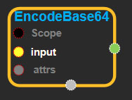
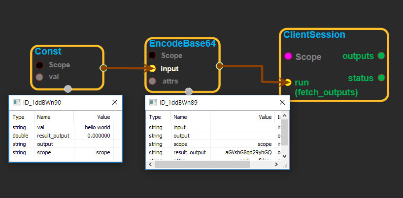

--- 
layout: default 
title: EncodeBase64 
parent: string_ops 
grand_parent: enuSpace-Tensorflow API 
last_modified_date: now 
--- 

# EncodeBase64

---

## tensorflow C++ API

[tensorflow::ops::EncodeBase64](https://www.tensorflow.org/api_docs/cc/class/tensorflow/ops/encode-base64)

Encode strings into web-safe base64 format.

---

## Summary

Refer to the following article for more information on base64 format: en.wikipedia.org/wiki/Base64. Base64 strings may have padding with '=' at the end so that the encoded has length multiple of 4. See Padding section of the link above.

Web-safe means that the encoder uses - and \_ instead of + and /.

Arguments:

* scope: A [Scope](https://www.tensorflow.org/api_docs/cc/class/tensorflow/scope.html#classtensorflow_1_1_scope) object
* input: Strings to be encoded.

Optional attributes \(see [`Attrs`](https://www.tensorflow.org/api_docs/cc/struct/tensorflow/ops/encode-base64/attrs.html#structtensorflow_1_1ops_1_1_encode_base64_1_1_attrs)\):

* pad: Bool whether padding is applied at the ends.

Returns:

* [`Output`](https://www.tensorflow.org/api_docs/cc/class/tensorflow/output.html#classtensorflow_1_1_output): [Input](https://www.tensorflow.org/api_docs/cc/class/tensorflow/input.html#classtensorflow_1_1_input) strings encoded in base64.

---

## EncodeBase64 block

Source link : [https://github.com/EXPNUNI/enuSpaceTensorflow/blob/master/enuSpaceTensorflow/tf\_string.cpp](https://github.com/EXPNUNI/enuSpaceTensorflow/blob/master/enuSpaceTensorflow/tf_string.cpp)

Argument:

* Scope scope : A Scope object \(A scope is generated automatically each page. A scope is not connected.\)
* Input input: connect  Input node.
* EncodeBase64::Attrs attrs : Input attrs in value. ex\) pad\_ = false;

Return:

* Output output : Output object of EncodeBase64 class object.

Result:

* std::vector\(Tensor\) product\_result : Returned object of executed result by calling session.

---

## Using Method

