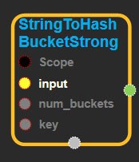
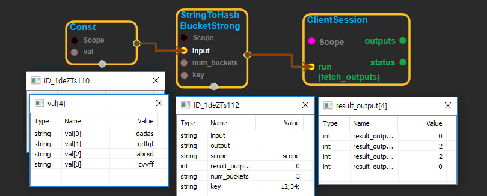

--- 
layout: default 
title: StringToHashBucketStrong 
parent: string_ops 
grand_parent: enuSpace-Tensorflow API 
last_modified_date: now 
--- 

# StringToHashBucketStrong

---

## tensorflow C++ API

[tensorflow::ops::StringToHashBucketStrong](https://www.tensorflow.org/api_docs/cc/class/tensorflow/ops/string-to-hash-bucket-strong)

Converts each string in the input [Tensor](https://www.tensorflow.org/api_docs/cc/class/tensorflow/tensor.html#classtensorflow_1_1_tensor) to its hash mod by a number of buckets.

---

## Summary

The hash function is deterministic on the content of the string within the process. The hash function is a keyed hash function, where attribute `key` defines the key of the hash function. `key` is an array of 2 elements.

A strong hash is important when inputs may be malicious, e.g. URLs with additional components. Adversaries could try to make their inputs hash to the same bucket for a denial-of-service attack or to skew the results. A strong hash prevents this by making it difficult, if not infeasible, to compute inputs that hash to the same bucket. This comes at a cost of roughly 4x higher compute time than `tf.string_to_hash_bucket_fast`.

Arguments:

* scope: A [Scope](https://www.tensorflow.org/api_docs/cc/class/tensorflow/scope.html#classtensorflow_1_1_scope) object
* input: The strings to assign a hash bucket.
* num\_buckets: The number of buckets.
* key: The key for the keyed hash function passed as a list of two uint64 elements.

Returns:

* [`Output`](https://www.tensorflow.org/api_docs/cc/class/tensorflow/output.html#classtensorflow_1_1_output): A [Tensor](https://www.tensorflow.org/api_docs/cc/class/tensorflow/tensor.html#classtensorflow_1_1_tensor) of the same shape as the input `string_tensor`

---

## StringToHashBucketStrong block

Source link : [https://github.com/EXPNUNI/enuSpaceTensorflow/blob/master/enuSpaceTensorflow/tf\_string.cpp](https://github.com/EXPNUNI/enuSpaceTensorflow/blob/master/enuSpaceTensorflow/tf_string.cpp)

Argument:

* Scope scope : A Scope object \(A scope is generated automatically each page. A scope is not connected.\)
* Input input: connect  Input node.
* num\_buckets : Input num\_buckets in value. 
* key: Input key in value. 

Return:

* Output output : Output object of StringToHashBucketStrong class object.

Result:

* std::vector\(Tensor\) product\_result : Returned object of executed result by calling session.

---

## Using Method

