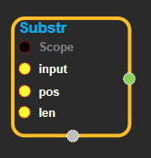
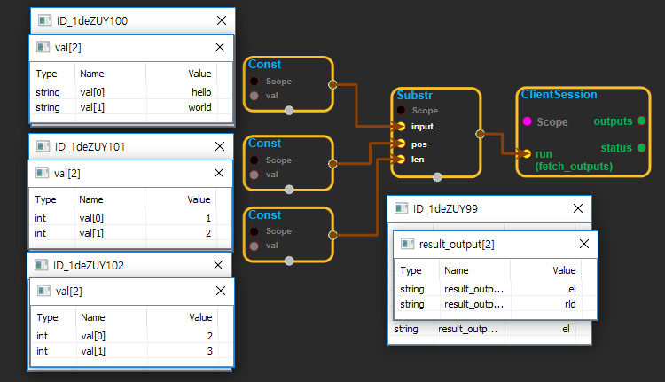

--- 
layout: default 
title: Substr 
parent: string_ops 
grand_parent: enuSpace-Tensorflow API 
last_modified_date: now 
--- 

# Substr

---

## tensorflow C++ API

[tensorflow::ops::Substr](https://www.tensorflow.org/api_docs/cc/class/tensorflow/ops/substr)

Return substrings from [`Tensor`](https://www.tensorflow.org/api_docs/cc/class/tensorflow/tensor.html#classtensorflow_1_1_tensor) of strings.

---

## Summary

For each string in the input [`Tensor`](https://www.tensorflow.org/api_docs/cc/class/tensorflow/tensor.html#classtensorflow_1_1_tensor), creates a substring starting at index `pos` with a total length of `len`.

If `len` defines a substring that would extend beyond the length of the input string, then as many characters as possible are used.

If `pos` is negative or specifies a character index larger than any of the input strings, then an `InvalidArgumentError` is thrown.

`pos` and `len` must have the same shape, otherwise a `ValueError` is thrown on Op creation.

NOTE: [`Substr`](https://www.tensorflow.org/api_docs/cc/class/tensorflow/ops/substr.html#classtensorflow_1_1ops_1_1_substr) supports broadcasting up to two dimensions. More about broadcasting [here](http://docs.scipy.org/doc/numpy/user/basics.broadcasting.html)

---

Examples

Using scalar `pos` and `len`:

\`\`\`python input = \[b'Hello', b'World'\] position = 1 length = 3

output = \[b'ell', b'orl'\] \`\`\`

Using `pos` and `len` with same shape as `input`:

\`\`\`python input = \[\[b'ten', b'eleven', b'twelve'\], \[b'thirteen', b'fourteen', b'fifteen'\], \[b'sixteen', b'seventeen', b'eighteen'\]\] position = \[\[1, 2, 3\], \[1, 2, 3\], \[1, 2, 3\]\] length = \[\[2, 3, 4\], \[4, 3, 2\], \[5, 5, 5\]\]

output = \[\[b'en', b'eve', b'lve'\], \[b'hirt', b'urt', b'te'\], \[b'ixtee', b'vente', b'hteen'\]\] \`\`\`

Broadcasting `pos` and `len` onto `input`:

\`\`\` input = \[\[b'ten', b'eleven', b'twelve'\], \[b'thirteen', b'fourteen', b'fifteen'\], \[b'sixteen', b'seventeen', b'eighteen'\], \[b'nineteen', b'twenty', b'twentyone'\]\] position = \[1, 2, 3\] length = \[1, 2, 3\]

output = \[\[b'e', b'ev', b'lve'\], \[b'h', b'ur', b'tee'\], \[b'i', b've', b'hte'\], \[b'i', b'en', b'nty'\]\] \`\`\`

Broadcasting `input` onto `pos` and `len`:

\`\`\` input = b'thirteen' position = \[1, 5, 7\] length = \[3, 2, 1\]

output = \[b'hir', b'ee', b'n"\] \`\`\`

Arguments:

* scope: A [Scope](https://www.tensorflow.org/api_docs/cc/class/tensorflow/scope.html#classtensorflow_1_1_scope) object
* input: [Tensor](https://www.tensorflow.org/api_docs/cc/class/tensorflow/tensor.html#classtensorflow_1_1_tensor) of strings
* pos: Scalar defining the position of first character in each substring
* len: Scalar defining the number of characters to include in each substring

Returns:

* [`Output`](https://www.tensorflow.org/api_docs/cc/class/tensorflow/output.html#classtensorflow_1_1_output): [Tensor](https://www.tensorflow.org/api_docs/cc/class/tensorflow/tensor.html#classtensorflow_1_1_tensor) of substrings

---

## Substr block

Source link : [https://github.com/EXPNUNI/enuSpaceTensorflow/blob/master/enuSpaceTensorflow/tf\_string.cpp](https://github.com/EXPNUNI/enuSpaceTensorflow/blob/master/enuSpaceTensorflow/tf_string.cpp)

Argument:

* Scope scope : A Scope object \(A scope is generated automatically each page. A scope is not connected.\)
* Input input: connect  Input node.
* Input pos: connect  Input node.
* Input len: connect  Input node.

Return:

* Output output : Output object of Substr class object.

Result:

* std::vector\(Tensor\) product\_result : Returned object of executed result by calling session.

---

## Using Method

