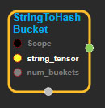
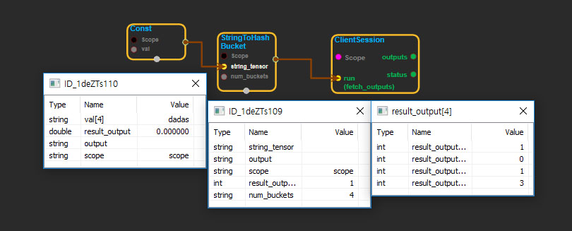

--- 
layout: default 
title: StringToHashBucket 
parent: string_ops 
grand_parent: enuSpace-Tensorflow API 
last_modified_date: now 
--- 

# StringToHashBucket

---

## tensorflow C++ API

[tensorflow::ops::StringToHashBucket](https://www.tensorflow.org/api_docs/cc/class/tensorflow/ops/string-to-hash-bucket)

Converts each string in the input [Tensor](https://www.tensorflow.org/api_docs/cc/class/tensorflow/tensor.html#classtensorflow_1_1_tensor) to its hash mod by a number of buckets.

---

## Summary

The hash function is deterministic on the content of the string within the process.

Note that the hash function may change from time to time. This functionality will be deprecated and it's recommended to use `tf.string_to_hash_bucket_fast()` or `tf.string_to_hash_bucket_strong()`.

Arguments:

* scope: A [Scope](https://www.tensorflow.org/api_docs/cc/class/tensorflow/scope.html#classtensorflow_1_1_scope) object
* num\_buckets: The number of buckets.

Returns:

* [`Output`](https://www.tensorflow.org/api_docs/cc/class/tensorflow/output.html#classtensorflow_1_1_output): A [Tensor](https://www.tensorflow.org/api_docs/cc/class/tensorflow/tensor.html#classtensorflow_1_1_tensor) of the same shape as the input `string_tensor`.

---

## StringToHashBucket block

Source link : [https://github.com/EXPNUNI/enuSpaceTensorflow/blob/master/enuSpaceTensorflow/tf\_string.cpp](https://github.com/EXPNUNI/enuSpaceTensorflow/blob/master/enuSpaceTensorflow/tf_string.cpp)

Argument:

* Scope scope : A Scope object \(A scope is generated automatically each page. A scope is not connected.\)
* Input input: connect  Input node.
* num\_buckets : Input num\_buckets in value. 

Return:

* Output output : Output object of StringToHashBucket  class object.

Result:

* std::vector\(Tensor\) product\_result : Returned object of executed result by calling session.

---

## Using Method

