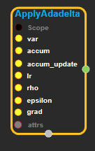
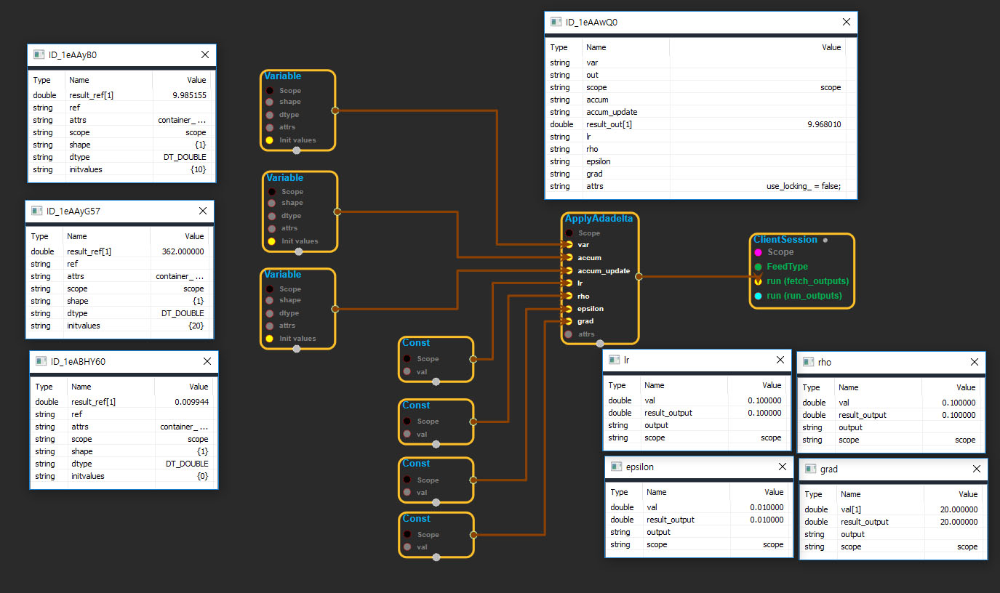

--- 
layout: default 
title: ApplyAdadelta 
parent: training_ops 
grand_parent: enuSpace-Tensorflow API 
last_modified_date: now 
--- 

# ApplyAdadelta 

---

## tensorflow C++ API

[tensorflow::ops::ApplyAdadelta](https://www.tensorflow.org/api_docs/cc/class/tensorflow/ops/apply-adadelta)

Update '\*var' according to the adadelta scheme.

---

## Summary

accum = rho\(\) \* accum + \(1 - rho\(\)\) \* grad.square\(\); update = \(update\_accum + epsilon\).sqrt\(\) \* \(accum + epsilon\(\)\).rsqrt\(\) \* grad; update\_accum = rho\(\) \* update\_accum + \(1 - rho\(\)\) \* update.square\(\); var -= update;

Arguments:

* scope: A [Scope](https://www.tensorflow.org/api_docs/cc/class/tensorflow/scope.html#classtensorflow_1_1_scope) object
* var: Should be from a Variable\(\).
* accum: Should be from a Variable\(\).
* accum\_update: Should be from a Variable\(\).
* lr: Scaling factor. Must be a scalar.
* rho: Decay factor. Must be a scalar.
* epsilon: Constant factor. Must be a scalar.
* grad: The gradient.

Optional attributes \(see[`Attrs`](https://www.tensorflow.org/api_docs/cc/struct/tensorflow/ops/apply-adadelta/attrs.html#structtensorflow_1_1ops_1_1_apply_adadelta_1_1_attrs)\):

* use\_locking: If True, updating of the var, accum and update\_accum tensors will be protected by a lock; otherwise the behavior is undefined, but may exhibit less contention.

Returns:

* [`Output`](https://www.tensorflow.org/api_docs/cc/class/tensorflow/output.html#classtensorflow_1_1_output): Same as "var".

---

## ApplyAdadelta block

Source link : [https://github.com/EXPNUNI/enuSpaceTensorflow/blob/master/enuSpaceTensorflow/tf\_training.cpp](https://github.com/EXPNUNI/enuSpaceTensorflow/blob/master/enuSpaceTensorflow/tf_string.cpp)

Argument:

* Scope scope : A Scope object \(A scope is generated automatically each page. A scope is not connected.\)
* Input var: connect  Input node.
* Input accum: connect  Input node.
* Input accum\_update: connect  Input node.
* Input lr: connect  Input node.
* Input rho: connect  Input node.
* Input epsilon: connect  Input node.
* Input grad: connect  Input node.
* ApplyAdadelta ::Attrs attrs : Input attrs in value. ex\) use\_locking\_ = false;

Return:

* Output output : Output object of ApplyAdadelta class object.

Result:

* std::vector\(Tensor\) result\_output : Returned object of executed result by calling session.

---

## Using Method

