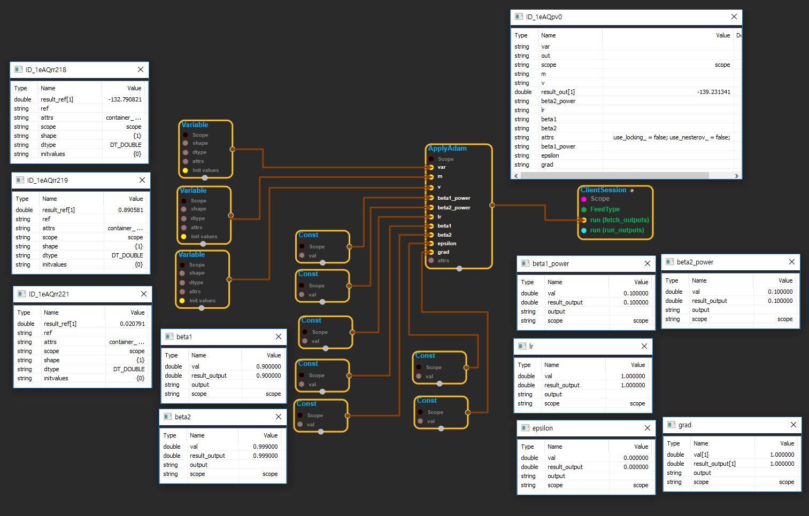

--- 
layout: default 
title: ApplyAdam 
parent: training_ops 
grand_parent: enuSpace-Tensorflow API 
last_modified_date: now 
--- 

# ApplyAdam

---

## tensorflow C++ API

[tensorflow::ops::ApplyAdam](https://www.tensorflow.org/api_docs/cc/class/tensorflow/ops/apply-adam)

Update '\*var' according to the Adam algorithm.

---

## Summary

lr\_t &lt;- learning\_rate \* sqrt\(1 - beta2^t\) / \(1 - beta1^t\) m\_t &lt;- beta1 \* m\_{t-1} + \(1 - beta1\) \* g\_t v\_t &lt;- beta2 \* v\_{t-1} + \(1 - beta2\) \* g\_t \* g\_t variable &lt;- variable - lr\_t \* m\_t / \(sqrt\(v\_t\) + epsilon\)

Arguments:

* scope: A [Scope](https://www.tensorflow.org/api_docs/cc/class/tensorflow/scope.html#classtensorflow_1_1_scope) object
* var: Should be from a Variable\(\).
* m: Should be from a Variable\(\).
* v: Should be from a Variable\(\).
* beta1\_power: Must be a scalar.
* beta2\_power: Must be a scalar.
* lr: Scaling factor. Must be a scalar.
* beta1: Momentum factor. Must be a scalar.
* beta2: Momentum factor. Must be a scalar.
* epsilon: Ridge term. Must be a scalar.
* grad: The gradient.

Optional attributes \(see[`Attrs`](https://www.tensorflow.org/api_docs/cc/struct/tensorflow/ops/apply-adam/attrs.html#structtensorflow_1_1ops_1_1_apply_adam_1_1_attrs)\):

* use\_locking: If `True`, updating of the var, m, and v tensors will be protected by a lock; otherwise the behavior is undefined, but may exhibit less contention.
* use\_nesterov: If `True`, uses the nesterov update.

Returns:

* [`Output`](https://www.tensorflow.org/api_docs/cc/class/tensorflow/output.html#classtensorflow_1_1_output) : Same as "var".

---

## ApplyAdam block

Source link : [https://github.com/EXPNUNI/enuSpaceTensorflow/blob/master/enuSpaceTensorflow/tf\_training.cpp](https://github.com/EXPNUNI/enuSpaceTensorflow/blob/master/enuSpaceTensorflow/tf_string.cpp)

Argument:

* Scope scope : A Scope object \(A scope is generated automatically each page. A scope is not connected.\)
* Input var: connect  Input node.
* Input m: connect  Input node.
* Input v: connect  Input node.
* Input beta1\_power: connect  Input node.
* Input beta2\_power: connect  Input node.
* Input lr: connect  Input node.
* Input beta1: connect  Input node.
* Input beta2: connect  Input node.
* Input epsilon: connect  Input node.
* Input grad: connect  Input node.
* ApplyAdam ::Attrs attrs : Input attrs in value. ex\) use\_locking\_ = false;use_nesterov\__=false;

Return:

* Output output : Output object of ApplyAdam class object.

Result:

* std::vector\(Tensor\) result\_output : Returned object of executed result by calling session.

---

## Using Method

