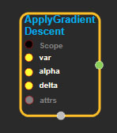

--- 
layout: default 
title: ApplyGradientDescent 
parent: training_ops 
grand_parent: enuSpace-Tensorflow API 
last_modified_date: now 
--- 

# ApplyGradientDescent

---

## tensorflow C++ API

[tensorflow::ops::ApplyGradientDescent](https://www.tensorflow.org/api_docs/cc/class/tensorflow/ops/apply-gradient-descent)

Update '\*var' by subtracting 'alpha' \* 'delta' from it.

---

## Summary

Arguments:

* scope: A [Scope](https://www.tensorflow.org/api_docs/cc/class/tensorflow/scope.html#classtensorflow_1_1_scope) object
* var: Should be from a Variable\(\).
* alpha: Scaling factor. Must be a scalar.
* delta: The change.

Optional attributes \(see[`Attrs`](https://www.tensorflow.org/api_docs/cc/struct/tensorflow/ops/apply-gradient-descent/attrs.html#structtensorflow_1_1ops_1_1_apply_gradient_descent_1_1_attrs)\):

* use\_locking: If `True`, the subtraction will be protected by a lock; otherwise the behavior is undefined, but may exhibit less contention.

Returns:

* [`Output`](https://www.tensorflow.org/api_docs/cc/class/tensorflow/output.html#classtensorflow_1_1_output) : Same as "var".

---

## ApplyGradientDescent block

Source link : [https://github.com/EXPNUNI/enuSpaceTensorflow/blob/master/enuSpaceTensorflow/tf\_training.cpp](https://github.com/EXPNUNI/enuSpaceTensorflow/blob/master/enuSpaceTensorflow/tf_string.cpp)

Argument:

* Scope scope : A Scope object \(A scope is generated automatically each page. A scope is not connected.\)
* Input var: connect  Input node.
* Input alpha: connect  Input node.
* Input delta: connect  Input node.
* ApplyGradientDescent ::Attrs attrs : Input attrs in value. ex\) use\_locking\_ = false;

Return:

* Output output : Output object of ApplyFtrl class object.

Result:

* std::vector\(Tensor\) result\_output : Returned object of executed result by calling session.

---

## Using Method

