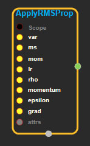
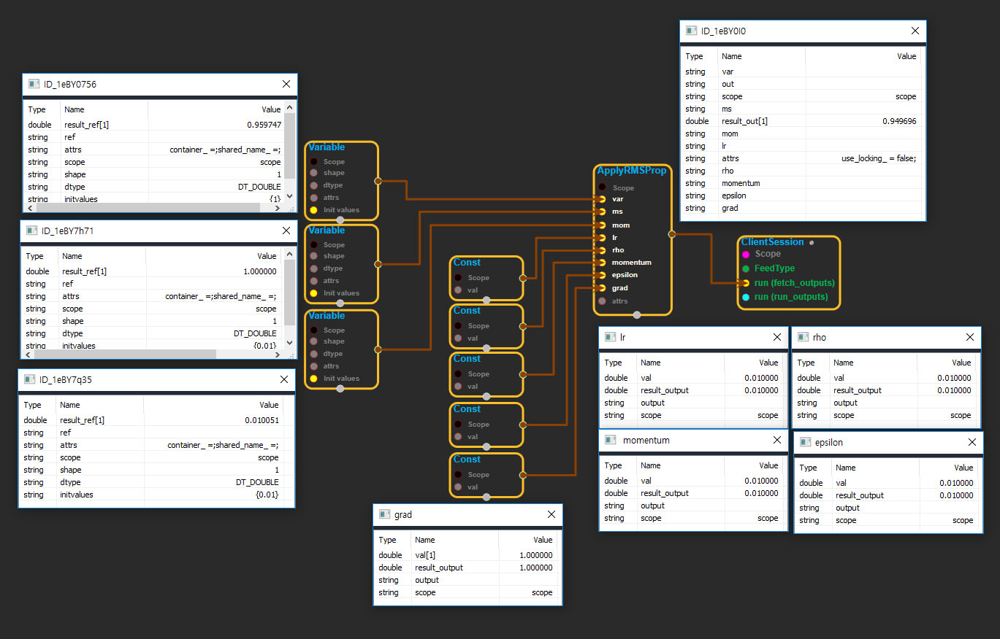

--- 
layout: default 
title: ApplyRMSProp 
parent: training_ops 
grand_parent: enuSpace-Tensorflow API 
last_modified_date: now 
--- 

# ApplyRMSProp

---

## tensorflow C++ API

[tensorflow::ops::ApplyRMSProp](https://www.tensorflow.org/api_docs/cc/class/tensorflow/ops/apply-r-m-s-prop)

Update '\*var' according to the RMSProp algorithm.

---

## Summary

Note that in dense implementation of this algorithm, ms and mom will update even if the grad is zero, but in this sparse implementation, ms and mom will not update in iterations during which the grad is zero.

mean\_square = decay \* mean\_square + \(1-decay\) \* gradient \*\* 2 Delta = learning\_rate \* gradient / sqrt\(mean\_square + epsilon\)

ms &lt;- rho \* ms\_{t-1} + \(1-rho\) \* grad \* grad mom &lt;- momentum \* mom\_{t-1} + lr \* grad / sqrt\(ms + epsilon\) var &lt;- var - mom

Arguments:

* scope: A [Scope](https://www.tensorflow.org/api_docs/cc/class/tensorflow/scope.html#classtensorflow_1_1_scope) object
* var: Should be from a Variable\(\).
* ms: Should be from a Variable\(\).
* mom: Should be from a Variable\(\).
* lr: Scaling factor. Must be a scalar.
* rho: Decay rate. Must be a scalar.
* epsilon: Ridge term. Must be a scalar.
* grad: The gradient.

Optional attributes \(see[`Attrs`](https://www.tensorflow.org/api_docs/cc/struct/tensorflow/ops/apply-r-m-s-prop/attrs.html#structtensorflow_1_1ops_1_1_apply_r_m_s_prop_1_1_attrs)\):

* use\_locking: If `True`, updating of the var, ms, and mom tensors is protected by a lock; otherwise the behavior is undefined, but may exhibit less contention.

Returns:

* [`Output`](https://www.tensorflow.org/api_docs/cc/class/tensorflow/output.html#classtensorflow_1_1_output): Same as "var".

---

## ApplyRMSProp block

Source link : [https://github.com/EXPNUNI/enuSpaceTensorflow/blob/master/enuSpaceTensorflow/tf\_training.cpp](https://github.com/EXPNUNI/enuSpaceTensorflow/blob/master/enuSpaceTensorflow/tf_string.cpp)

Argument:

* Scope scope : A Scope object \(A scope is generated automatically each page. A scope is not connected.\)
* Input var: connect  Input node.
* Input ms: connect  Input node.
* Input mom: connect  Input node.
* Input lr: connect  Input node.
* Input rho: connect  Input node.
* Input momentum: connect  Input node.
* Input epsilon: connect  Input node.
* Input grad: connect  Input node.
* ApplyRMSProp ::Attrs attrs : Input attrs in value. ex\) use\_locking\_ = false;

Return:

* Output output : Output object of ApplyRMSProp class object.

Result:

* std::vector\(Tensor\) result\_output : Returned object of executed result by calling session.

---

## Using Method

