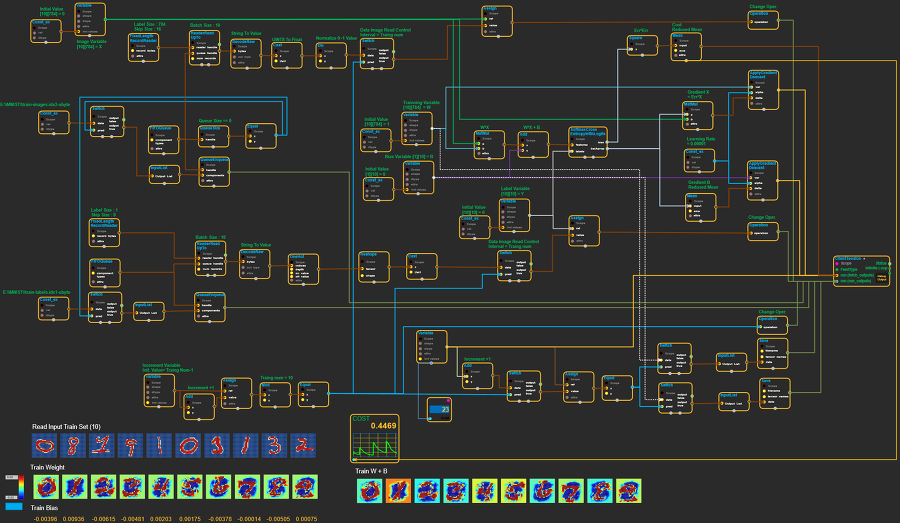
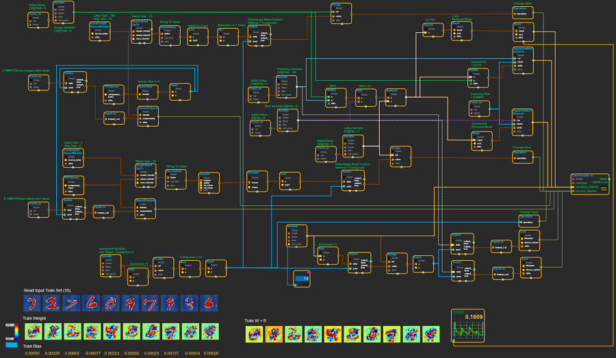
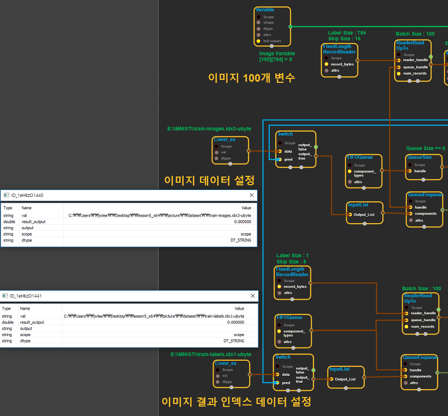
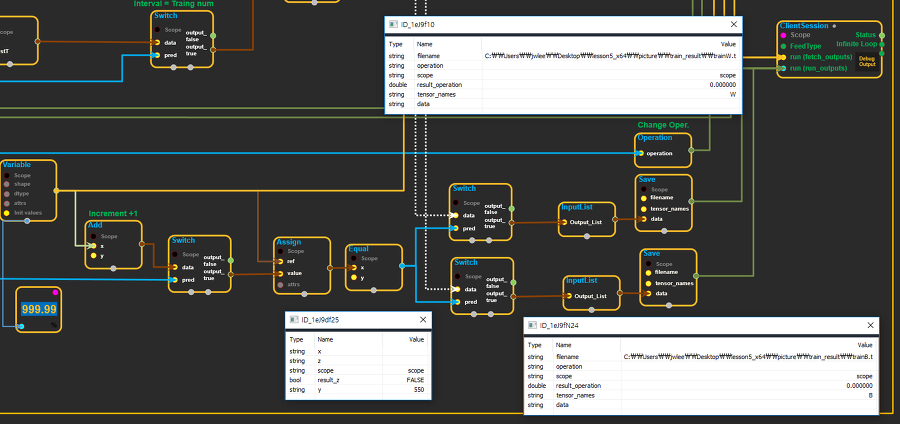
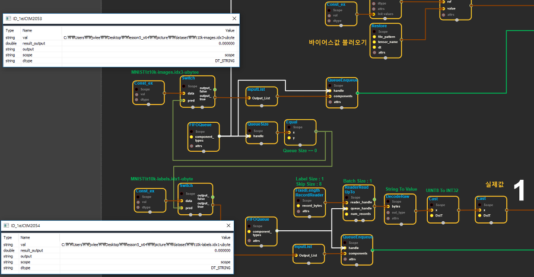
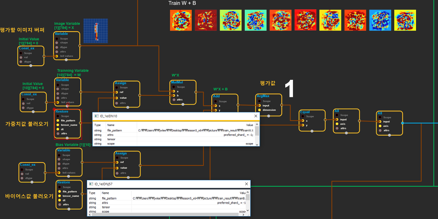
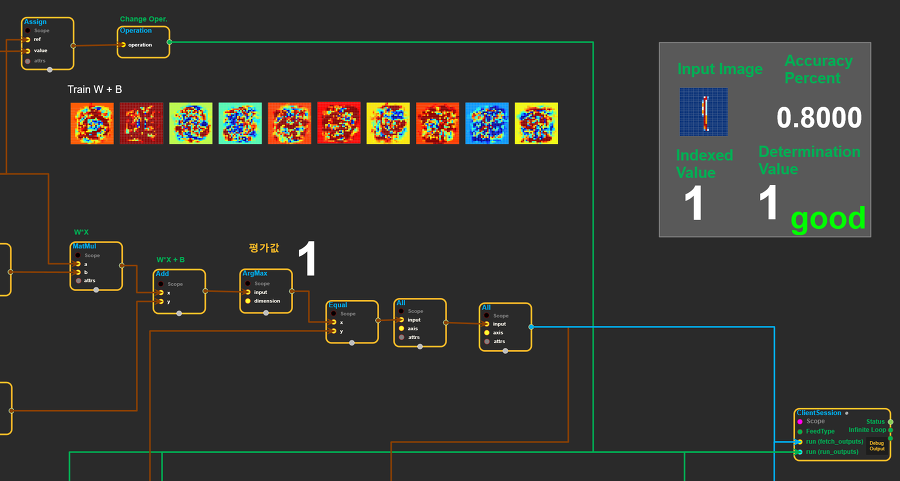
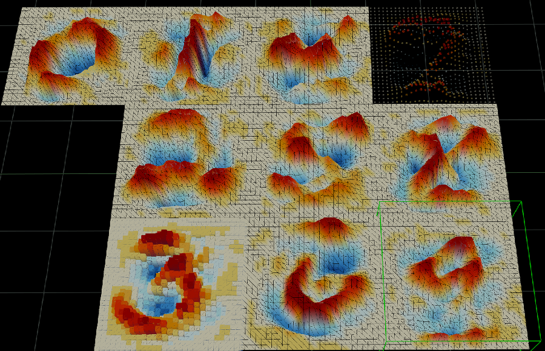

--- 
layout: default 
title: Mnist Linear Regression 
parent: enuSpace-Tensorflow Tutorial 
last_modified_date: now 
--- 

# MNIST linear regression {#mnist-linear-regression}

---

MNIST dataset을 이용하여 linear regression 알고리즘을 enuSpace-Tensorflow를 이용한 사용 방법을 설명합니다.

### Python**를 이용한 구현** {#python를-이용한-구현}

참고 :[http://www.xiaoliangbai.com/2017/02/01/tensorflow-applying-linear-regression-on-mnist-dataset](http://www.xiaoliangbai.com/2017/02/01/tensorflow-applying-linear-regression-on-mnist-dataset)

```py
import sys
import time
import numpy as np
import tensorflow as tf
import matplotlib.pyplot as plt
from tensorflow.examples.tutorials.mnist import input_data
%matplotlib inline

%load_ext autoreload
%autoreload 2

MNIST = input_data.read_data_sets("MNIST_data", one_hot=True)

# Define parameters for linear model
learning_rate = 0.01
batch_size = 128
n_epochs = 25

# Create placeholders
X = tf.placeholder(tf.float32, [batch_size, 784], name="image")
Y = tf.placeholder(tf.float32, [batch_size, 10], name="label")

# Create weights and bias
w = tf.Variable(tf.random_normal(shape=[784, 10], stddev=0.01), name="weights")
b = tf.Variable(tf.zeros([1,10]), name='bias')

# calculate scores
logits = tf.matmul(X, w) + b

# Entropy cost function and loss
entropy = tf.nn.softmax_cross_entropy_with_logits(logits, Y)
loss = tf.reduce_mean(entropy)

# Define optimizer
optimizer = tf.train.GradientDescentOptimizer(learning_rate=learning_rate).minimize(loss)

# Run optimization and test
loss_history = []
acc_history = []
init = tf.global_variables_initializer()
with tf.Session() as sess:
    sess.run(init)
    n_batches = int(MNIST.train.num_examples/batch_size)
    for i in range(n_epochs):
        for _ in range(n_batches):
            X_batch, Y_batch = MNIST.train.next_batch(batch_size)
            _, loss_value = sess.run([optimizer, loss], feed_dict={X: X_batch, Y:Y_batch})
        loss_history.append(loss_value)

        # Check validation accuracy    
        n_v_batches = int(MNIST.validation.num_examples/batch_size)
        total_correct_preds = 0
        for j in range(n_v_batches):
            X_batch, Y_batch = MNIST.validation.next_batch(batch_size)
            _, loss_batch, logits_batch = sess.run([optimizer, loss, logits], feed_dict={X: X_batch, Y:Y_batch})
            preds = tf.nn.softmax(logits_batch)
            correct_preds = tf.equal(tf.argmax(preds, 1), tf.argmax(Y_batch, 1))
            accuracy = tf.reduce_sum(tf.cast(correct_preds, tf.float32))
            total_correct_preds += sess.run(accuracy)
        validation_accuracy = total_correct_preds/MNIST.validation.num_examples
        acc_history.append(validation_accuracy)


    # Test the model
    n_batches = int(MNIST.test.num_examples/batch_size)
    total_correct_preds = 0
    for i in range(n_batches):
        X_batch, Y_batch = MNIST.test.next_batch(batch_size)
        logits_batch = sess.run(logits, feed_dict={X: X_batch, Y:Y_batch})
        preds = tf.nn.softmax(logits_batch)
        correct_preds = tf.equal(tf.argmax(preds, 1), tf.argmax(Y_batch, 1))
        accuracy = tf.reduce_sum(tf.cast(correct_preds, tf.float32))
        total_correct_preds += sess.run(accuracy)

    print "Test accuracy is {0}".format(total_correct_preds/MNIST.test.num_examples)
```

### 

### **enuSpace-Tensorflow를 이용한 구현** {#enuspace-tensorflow를-이용한-구현}

#### Training model 1 \(SoftmaxCrossEntropyWidthLogits\) {#training-model-1-softmaxcrossentropywidthlogits}

아래 그리픽 모델은 SoftmaxCrossEntropyWidthLogits 객체를 이용하여 그래픽 블럭을 이용하여 각 객체의 핀정보에 대하여 연결선을 수행한 화면이다.



##### Training model \(Subtract\) {#training-model-subtract}

아래 그래픽 모델은 Subtract객체를 이용하여 그래픽 블럭을 이용하여 각 객체의 핀정보에 대하여 연결선을 수행한 화면이다.



#### 각 블럭별 기능 설명 {#각-블럭별-기능-설명}

##### 데이터 셋 불러오기 {#데이터-셋-불러오기}

각 블럭중 데이터셋을 불러와 전달을 수행하기 위한 FIFOQueue , FIFOEnqueue를 활용한다. 한번에 불러올 이미지의 배치 사이즈를 설정한다. 본 모델은 100개를 적용하였다.



##### Cost값 Gradient {#cost값-gradient}

불러온 이미지 데이터 셋을 이용하여 Weight변수와 Bias변수를 생성하여 Cost를 경사하강법을 이용하여 Training을 수행하였다.

##### Traing 결과 저장 {#traing-결과-저장}

Training을 특정 개수에 도달하면, Weight와 Bias의 텐서값을 저장하기 위하여 아래그림과 같이 구성하였다.



## Evaluation Model {#evaluation-model}

앞에서 저장된 Weight, Bias의 값을 이용하여 평가를 수행하는 모델이다.


#### 평가용 dataset 가져오기 {#평가용-dataset-가져오기}

평가를 수행하기 위해서 평가용 데이터셋의 파일 위치를 지정하여 매 실행마다 불러오기를 수행한다.



#### Train 결과값 불러오기 {#train-결과값-불러오기}

앞 Training Model에서 저장한 Weight, Bias 텐서값을 불러오는 불럭이다.



#### 평가하기 {#평가하기}

평가용 데이터셋과 Weight, bias값을 불러왔다면 평가를 수행한다.



#### 평가 결과 출력하기 {#평가-결과-출력하기}

평가 결과를 출력하기 위하여 Counter와 판정결과값을 확인하기 블럭을 구성하였다.


# 3차원 Weight값 실시간 디스플레이 {#3차원-weight값-실시간-디스플레이}

Training 과정을 확인하기 위해서 Weight값을 3차원으로 확인하기 위한 픽쳐를 생성하여 실시간 변화정보에 대하여 확인한다.

SoftmaxCrossEntropyWidthLogits 이용한 모델 결과


Subtract 이용한 모델 결과.



